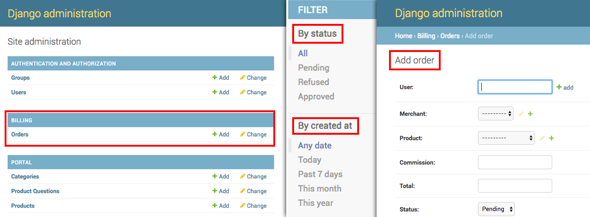

# Registrando Order no admin

Para que o administrador possa ter controle sobre as ordens, será necessário o registro de uma area administrativa para a entidade **Order**.

Assim como foi feito para a aplicação **portal**, será feito também para *billing*.

Para criar este registro será adicionado, no arquivo **billing/admin.py**, o código abaixo:

```py
from ajax_select import make_ajax_form
from ajax_select.admin import AjaxSelectAdmin
from django.contrib import admin

from billing.models import Order


class OrderAdmin(AjaxSelectAdmin):
    list_filter = ['status', 'created_at']
    list_display = ('id', 'user', 'merchant', 'commission', 'total', 'status')
    form = make_ajax_form(Order, {
        'user': 'user'
    })

admin.site.register(Order, OrderAdmin)
```

| Item         | Descrição                                                   |
|--------------|-------------------------------------------------------------|
| list_filter  | Configura quais filtros serão disponibilizados				 |
| list_display | Configura quais campos serão visíveis na listagem do painel |
| form         | Configura o uso de autocomplete via ajax                    |

Estamos aplicando **make_ajax_form** apenas para o campo de usuário, caso queira utilizar o mesmo recurso para outro campo basta duplicar a configuração como no exemplo abaixo:

```python
form = make_ajax_form(Order, {
    'user': 'user',
    'merchant': 'user',
})
```

Depois de criar a configuração de registro é necessário rodar o comando de criação das **migrations**.

```sh
python.exe .\manage.py makemigrations
```

O resultado deve ser o seguinte:

```
Migrations for 'billing':
  billing/migrations/0001_initial.py
    - Create model Order
```

Depois do comando de criação da migration é necessário rodar o comando de execução.

```sh
python.exe .\manage.py migrate
```

O resultado deve ser o seguinte:

```
Operations to perform:
  Apply all migrations: admin, auth, billing, contenttypes, portal, sessions
Running migrations:
  Applying billing.0001_initial... OK
```

Depois de rodar estes comandos basta acessar a parte administrativa do sistema para conferir o resultado.

Acesse o link **http://localhost:8000/admin/** e poderá ver o setor de billing criado e pronto para ser gerenciado.



Na imagem acima pode ver a visualização principal do painel, o setor de filtro, por status e data, e também pode ver uma imagem de uma seção de criação de uma nova ordem via painel administrativo.

Mais um passo foi dado para o gerenciamento completo do sistema de pagamento.