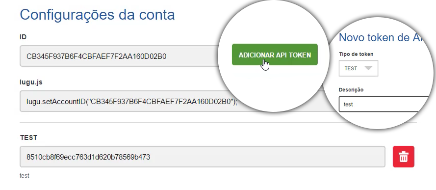

# Iniciando com Iugu

 Para o sistema de pagamento do projeto, adotamos o **Iugu**. Faremos toda adaptação do processo de pagamento de acordo com o sistema disponibilizado por esta tecnologia.

O modelo de ordens foi criado e o sistema administrativo também, basta prosseguirmos com o desenvolvimento.

Será necessário ter uma conta no site do *iugu*. Acesse <https://iugu.com/>.

Com iugu é possível:

1. cobrar um usuário
2. fazer transferências entre contas e muitos outros recursos.

Ao acessar o painel, será necessário alterá-lo para modo de teste. Desta forma, será possível fazer todos os testes de pagamento durante o processo de desenvolvimento.

Para facilitar o desenvolimento existe uma biblioteca de iugu para python. Para instalar esta biblioteca rode o comando abaixo:

```sh
pip3 install iugu-python
```

Lembrando que o comando **pip** depende de sua instalação e da versão que esteja utilizando.

Após a instalação é necessário configurar algumas variáveis para o funcionamento da biblioteca. Exemplos: 

* **account id**
* **api token**

Estas variáveis serão configuradas no arquivo **mktplace/mktplace/settings.py**.

```python
IUGU_ACCOUNT_ID = "0DF27980E6394A10B9062B05B3850..."
IUGU_API_TOKEN = "295872f5b368e0b1121b6e79ab8cd..."
```

Será necessário adicionar uma **API TOKEN** na seção **Configuração da Conta**, no painel administrativo do iugu. 

Inicialmente só existe acesso ao ID da conta. Veja a imagem abaixo:



Na imagem você visualiza o local de onde foram tirados os dados que adicionamos no projeto. Você deverá ter seus próprios dados para teste.

Depois de adicionar os dados de teste do iugu nas variáveis acima, crie um arquivo chamado **services.py**, na pasta **mktplace/billing**. 

Neste arquivo será adicionado qualquer tipo de serviço relacionado ao método de pagamento, como: 

1. comunicação com iugu 
2. algumas outras integrações  
3. todo tipo de regras de negócio, necessárias para conclusão do pagamento.

A princípio o conteúdo deste arquivo não terá nenhuma regra, mas será adicionada conforme a necessidade do projeto. Por enquanto conterá apenas o código abaixo:

```python
class BillingService(object):
    pass
```

O projeto terá basicamente 3 métodos principais. Por enquanto, deixaremos apenas um **pass** para que o Django não considere um erro e continue o processamento.

No próximo módulo será necessário fazer algumas adaptações em relação aos usuários do sistema, porque as configurações do iugu necessitarão dos dados do usuário para prosseguir o processamento.


