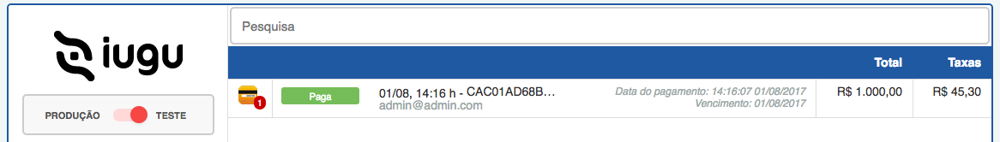
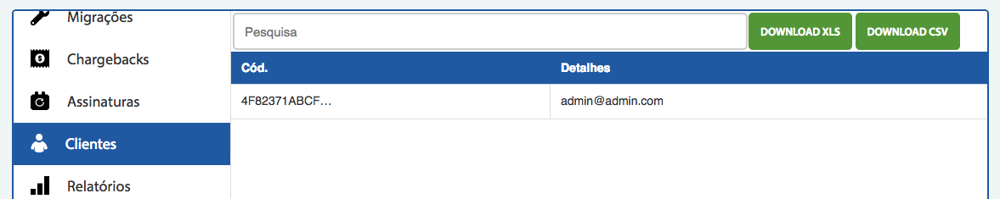
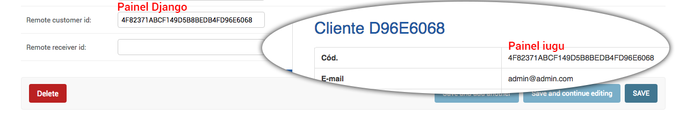

# Realizando o primeiro pagamento

Neste módulo efetuaremos o primeiro pagamento de forma prática, ou seja, quando o usuário preencher os campos do cartão e clicar em comprar, o sistema executará o método **charge**, que foi criado do módulo 60.

A lógica estará aplicada ao arquivo **billing/views.py**.

```python
from django.shortcuts import render, get_object_or_404

from billing.forms import PaymentForm
from billing.services import BillingService
from portal.models import Product


def payment(request, product_id):
    context = {}
    product = get_object_or_404(Product, pk=product_id)
    form = PaymentForm()
    context['product'] = product
    context['form'] = form

    user = request.user

    if request.method == "post":
        form = PaymentForm(request.POST)
        if form.is_valid():
            full_name = request.POST.get('first_name').split(' ', 1)
            card_data = {
                'description': 'Market Place Paument',
                'item_type': 'credit_cart',
                'data': {
                    'number': form.cleaned_data['number'],
                    'verification_value': form.cleaned_data['verification_value'],
                    'first_name': full_name[0],
                    'last_name': full_name[1],
                    'month': form.cleaned_data['month'],
                    'year': form.cleaned_data['year']
                }
            }

            context['form'] = form
            order = BillingService().charge(user, product, card_data)

    return render(request, 'billing/payment.html', context)
```

Acima foi disponibilizado o código completo do arquivo *views.py* para visão geral. Porém sua atenção deve estar no fragmento de código abaixo:

```python
if request.method == "post":
    form = PaymentForm(request.POST)
    if form.is_valid():
        full_name = request.POST.get('first_name').split(' ', 1)
        card_data = {
            'description': 'Market Place Paument',
            'item_type': 'credit_cart',
            'data': {
                'number': form.cleaned_data['number'],
                'verification_value': form.cleaned_data['verification_value'],
                'first_name': full_name[0],
                'last_name': full_name[1],
                'month': form.cleaned_data['month'],
                'year': form.cleaned_data['year']
            }
        }

        context['form'] = form
        order = BillingService().charge(user, product, card_data)
```

Assim como em outros arquivos de views o sistema faz um teste lógico para saber se a requisição é do tipo **POST**, caso seja o bloco acima é executado.

O próximo passo é verificar se o formulário é válido e caso seja acessa um outro bloco de código. Este segundo é o "coração" da lógica, onde o sistema monta o objeto **card_data**. Este objeto está formatado da maneira que a API do iugu exige para que a compra seja concluída com sucesso.

Qualquer dado faltante ou errado pode resultar em erro de finalização de compra para o usuário.

Depois de criar o objeto adicionamos os dados do formulário à variável context e logo depois executamos o método **charge**.

O método charge tentará efetuar o pagamento e retornará um resultado. Até este momento não será tratado o retorno, independente se será positivo ou negativo, primeiro será consultado o painel do iugu para verificar se foi possível efetuar o pagamento.

Acesse o link de compra de algum produto e adicione qualquer dado que não seja real. Veja os dados abaixo:

```
URL -> http://localhost:8000/payment/product/2

Nome do titular: Wesley Willians

Número do cartão: 4111 1111 1111 1111

Vencimento: 1

Ano: 2017

Cód.Segurança: 123
```

O número do cartão utilizado no exemplo é um número espefícifo que gera sempre sucesso, nos testes de compra, então qualquer outro número que utilizar vai gerar um erro. Pode pesquisar outros números de cartões para testes que a própria API do iugu fornece.

Ao clicar no botão comprar vai obter um erro porque a API do iugu exige que a variável IUGU_API_TOKEN seja configurada as variáveis de ambiente do servidor em que a aplicação está rodando. Por este motivo, duas alterações devem ser feitas:

1. Configurar o token em uma variável de ambiente do seu sistema operacional
2. Alterar arquivo **mktplace/settings.py** para carregar o valor da variável de ambiente.

### Criando variável de ambiente

**__Windows__**

Vá ao terminal e roda o seguinte comando:

```sh
$env:IUGU_API_TOKEN="295872f5b368e0b1121b6e79ab8cd..."
```

**__LINUX e MAC__**

```sh
export IUGU_API_TOKEN="295872f5b368e0b1121b6e79ab8cd..."
```

Lembrando que deverá ser inserido o valor do token criado no painel do iugu.

### Resgatando valor no arquivo mktplace/settings.py

```
// ANTES
IUGU_ACCOUNT_ID = "0DF27980E6394A10B9062B05B3850..."
IUGU_API_TOKEN = "295872f5b368e0b1121b6e79ab8cd..."

// DEPOIS
IUGU_ACCOUNT_ID = "0DF27980E6394A10B9062B05B3850..."
IUGU_API_TOKEN = os.environ['IUGU_API_TOKEN']
```

Depois de fazer estas alterações deverá ser feito um novo teste. Em alguns casos será necessário recarregar o terminal para que a alteração da variável de ambiente seja efetivada.

Ao finalizar a compra não deverá haver nenhum erro e a compra deverá aparecer no painel do iugu, no menun **faturas**.



Ao clicar sob a fatura você terá todos os dados referente a compra. 

Ao concluir a compra o sistema também criou o usuário no iugu e para vê-lo basta ir até o menu clientes.





Na imagem acima pode conferir que o usuário foi criado e que o mesmo código foi adicionado no painel administrativo do django. Basta acessar o painel e ir até o cliente que efetuou a compra e poderá conferir. Este código serve para relacionar o cliente às compras efetuadas no iugu.

Com a primeira compra efetuada com sucesso basta tratarmos do redirecionamento pós pagamento. Caso a compra seja efetuada com sucesso podemos redirecionar o usuário para uma página de sucesso, caso tenha erro podemos redirecionar ao formulário de pagamento informando o erro, para que o usuário possa tentar novamente.