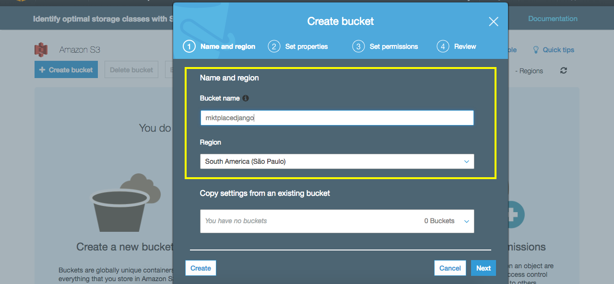
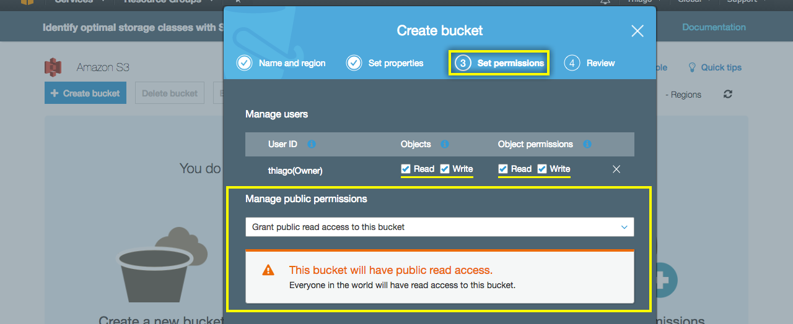
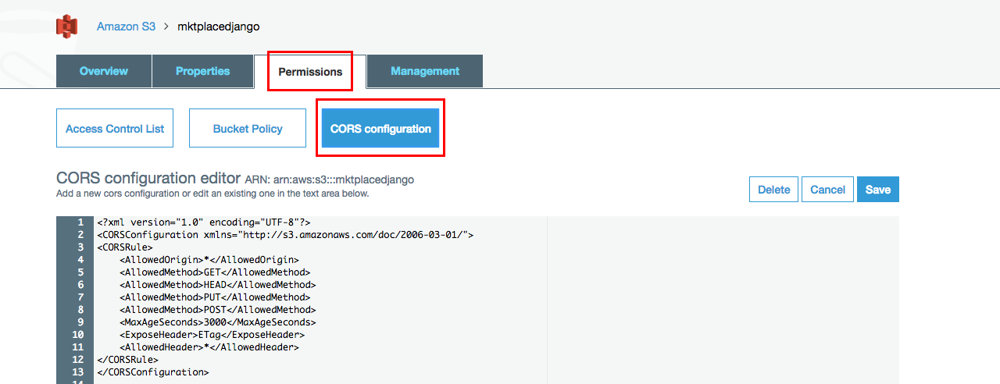

# Fazendo upload na amazon S3

Para iniciar o processo de upload, siga os passos:

1. Faça o login em sua conta da amazon
2. Acesse os serviços
3. Acesse o link do serviço **S3**
4. Crie um novo bucket, clicando no botão **Create bucket**


Na primeira tela você escolherá a região e o nome do bucket. No projeto foi escolhida a região de São Paulo e o nome do bucket foi **mktplacedjango**. Veja a imagem abaixo:



A segunda tela serve para adição de versões, logs e tags, mas não utilizaremos. Portanto, pode clicar next ou, se desejar, habilite os recursos.

Na terceira tela você deve configurar as permissões. A princípio o proprietário do bucket tem acesso de escrita e leitura.

Você deve habilitar leitura para os usuários para que eles possam enviar arquivos para o bucket.



Lembrando que o nome do bucket deve ser atribuído para uma constante presente no arquivo **mktplage/settings.py**.

```python
AWS_ACCESS_KEY_ID = ''
AWS_SECRET_ACCESS_KEY = ''
AWS_STORAGE_BUCKET_NAME = 'mktplacedjango'
S3DIRECT_REGION = 'sa-east-1' # Região de São Paulo tem este valor como configuração. Caso seja outra região pesquise na própria amazon que ela disponibiliza os códigos de cada região.
```

As duas primeiras constantes devem ser adicionadas de acordo sua conta.

Na quarta e última tela você deverá apenas criar o bucket, clicando em **Create Bucket**.

Após a criação do bucket e com as constantes configuradas, será necessário configurar o **CORS(Access Control Allow Origin)**, para liberar que outros domínios possam fazer requisições em seu domínio. Temos que definir quais origens poderão emitir requisições em nossa aplicação.

Se não liberarmos o CORS, nenhum usuário conseguirá fazer o upload de imagens pois haverá um erro de permissão.

Esta configuração será feita no bucket, no próprio painel da amazon.

Primeiro, clique sob seu bucket e acesse a sessão de permissões(permissions), depois clique em **CORS configuration**.



Adicione o código abaixo:

```
<CORSConfiguration>
    <CORSRule>
        <AllowedOrigin>*</AllowedOrigin>
        <AllowedMethod>PUT</AllowedMethod>
        <AllowedMethod>POST</AllowedMethod>
        <MaxAgeSeconds>3000</MaxAgeSeconds>
        <AllowedHeader>*</AllowedHeader>
    </CORSRule>
</CORSConfiguration>
```

Depois que adicionar o código nas configurações do seu bucket e salvar, já poderá acessar o painel e subir imagens em seus produtos.

O upload está funcionando somente no painel administrativo.

O objetivo agora será criar o mesmo procedimento na interface do usuário, uma vez que o **s3direct** já está funcionando.