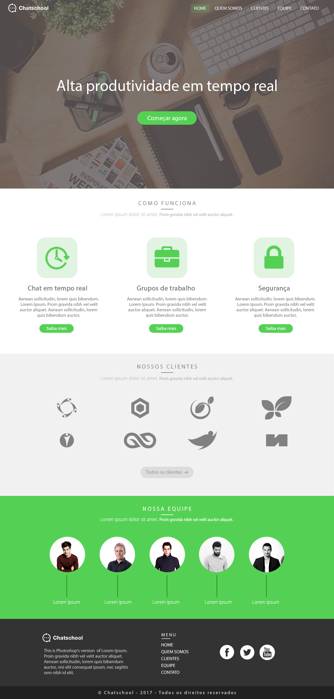

# Marcando as principais sessões do nosso projeto

Neste módulo, criaremos a primeira estrutura do nosso projeto final.

Vejam a página inicial do nosso projeto final:



Nosso projeto terá outras páginas como: **quem somos**, **equipe**, **contato**.

Analisando a nossa página inicial, podemos dizer que ela possui 3 blocos: cabeçalho, conteúdo e rodapé.

**Cabeçalho:** Trata-se da primeira imagem, local que está o logo e o menu do site.

**Conteúdo:** Trata-se dos 3 blocos que compõem o miolo do nosso site, ou seja, a parte do conteúdo interno. Vocês podem diferenciar pelas cores. O primeiro bloco é branco, o segundo, é cinza e o terceiro, é verde. Podem identificar por nomes, sendo: o primeiro, **Como Funciona**, o segundo, **Nossos Clientes** e o terceiro, **Nossa Equipe**.

**Rodapé:** Trata-se da última seção do nosso site, que está na cor preta. Vocês podem ver na imagem, facilmente, esta divisão. No rodapé, temos informações sobre o desenvolvedor, o app e as redes sociais.

Depois de falarmos sobre a estrutura principal do nosso layout, vamos para a prática. Marcaremos os três elementos principais.

```html
<!DOCTYPE html>
<html lang="en">
<head>
    <meta charset="UTF-8">
    <title>Title</title>
</head>
<body>
    <header id="header">Cabeçalho</header>
    <main>
        <section id="how-it-works">Como Funciona</section>
        <section id="customers">Nossos Clientes</section>
        <section id="team">Nosso Time</section>
    </main>
    <footer id="footer">Rodapé</footer>
</body>
</html>
```

Observem que, além das tags, adicionamos o atributo **ID**, para cada tag. O atributo id, deve ser único, não podendo ter repetição.

Para o cabeçalho, utilizamos a tag **header**, do html5. Para o conteúdo principal, utilizamos a tag **main** e, para o rodapé, utilizamos o **footer**.

Dentro do conteúdo principal, temos mais três seções, que dividimos com as tags, **section**.

Esta estruturação é muito importante, porque estamos trabalhando de forma semântica e os mecanismos de buscas interpretarão o nosso site, da melhor forma possível. Isso nos dará vantagem, em relação a outros sites, que não trabalham da forma correta.

Se vocês acessarem o browser e analisarem o arquivo index.html, verão que temos a estrutura montada mas, sem estilização. Por enquanto, é este, o resultado esperado. 
Nos próximos módulos, começaremos a inserir o CSS e o site começará a ter estilização, até chegarmos ao projeto final.