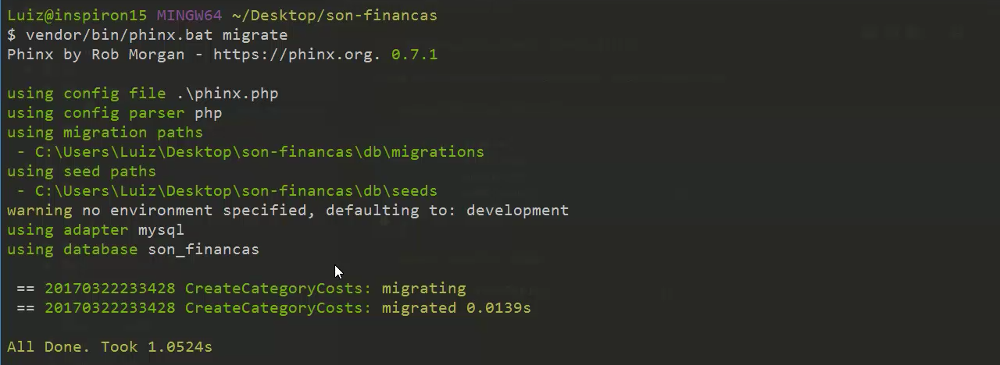

# Gerando primeira migração

No módulo passado, terminamos de fazer a configuração do phinx e já criamos uma migração. Falamos sobre o padrão que os arquivos são criados, em relação ao nome deles.

Informamos que os nomes devem ser intuitivos para que vocês leiam e já saibam o que aquela migração é responsável fazer no banco. A migration pode criar uma nova tabela, pode adicionar uma nova coluna, alterar uma coluna existente, fazer uma manutenção no banco de dados e muitas outras ações, portanto, um nome sugestivo, é muito importante para este conceito.

A vantagem é que mantemos todo banco de dados, configurado na linguagem que estamos trabalhando. Mas não é só esta a vantagem. Quando vocês precisam fazer uma alteração no banco, vocês criarão uma classe que faça isso pra vocês. Não farão, manualmente. Quando se trabalha em um ambiente cooperativo, vocês disponibilizam esta classe para os outros que, sempre, terão o banco de dados, atualizados, sem executarem nenhum comando SQL.

Se vocês, ainda, não conseguiram entender como isso funciona, vamos começar, na prática, a fazer nossa primeira migração.

Existem dois métodos principais: **up** e **down**.

```php
use Phinx\Migration\AbstractMigration;
class CreateCategoryCosts extends AbstractMigration
{
    public function up()
    {

    }
    public function down()
    {

    }
}
```

O método **up** é responsável por criar as tabelas ou colunas no banco de dados. Ele aplicará todos os comandos, que adicionarmos ao método, no banco de dados.

O método **down** serve para desfazer o que o comando up fez, ou seja, ele remove todos os campos que foram adicionados, pela função acima.

Um exemplo, prático, é quando vocês entregam a aplicação para o cliente e ele pede para adicionar um campo. Vocês adicionam, mas no dia que vão mostrar, novamente, ele fala que não acha necessário e pede que remova.

Utilizando o down, vocês só desfazem o que tinha sido feito, com up e pronto. Se tivessem que fazer manualmente, a tarefa não seria tão fácil assim.

A vantagem é que vocês não precisarão executar o SQL, manualmente. Todos os seus comandos serão gerados, através da biblioteca, tanto para criar, quanto para remover.

## Criando a tabela de centro de custos

Vejam que a classe criada pelo phinx é estendida da classe **AbstractMigration**. É nesta classe que se encontram todos os métodos que utilizaremos, a partir de agora.

```
use Phinx\Migration\AbstractMigration;
class CreateCategoryCosts extends AbstractMigration
{
    public function up()
    {
        $this->table('category_costs')
            ->addColumn('name', 'string')
            ->addColumn('created_at', 'datetime')
            ->addColumn('updated_at', 'datetime')
            ->save();
    }
    public function down()
    {
        $this->dropTable('category_costs');
    }
}
```

Vejam que estamos utilizando o método **table**, passando o nome da tabela a ser criada e depois, utilizando os métodos **addColumn** para adicionar colunas. Para o método addColumn, passamos o nome da coluna e o tipo que ela será.

Depois, o método down, destrói a nossa tabela, utilizando um **dropTable**, onde passamos o mesmo nome da tabela de criação, presente no método up.

O próximo passo será migrar a nossa migração. Antes, de qualquer coisa, temos que criar o banco de dados, que ainda não criamos. Vejam, novamente, os parâmetros das credenciais, para criarem o banco da forma correta, caso contrário, vocês terão um erro de conexão.

Agora, podemos rodar o comando que executa os métodos **up**, de todas as migrations criadas. Ou, podemos executar, individualmente. Rodaremos o comando principal, uma vez que temos, apenas, uma migration criada, até agora.

`vendor/bin/phinx.bat migrate`

Vejam o resultado que o terminal nos retornou:



Vejam que o comando executa o arquivo **phinx.php**, gera os **paths**, utiliza o ambiente de desenvolvimento, que setamos como default. Depois, reconhece o adapter, que foi mysql, reconhece a base de dados criada e, por último, cria a migração.

Agora, para conferirem se o comando, realmente, criou as colunas, rodem os comandos, abaixo:

```
mysql -uroot -proot

use son_financas

show tables;
```

O primeiro comando, acessa o mysql. O segundo, seleciona o banco de dados e o terceiro, lista todas as tabelas criadas para aquele banco.

Notem que teremos duas  tabelas: **category_costs** e **migrations**. A migrations é aquela tabela que criamos, para controlar as versões do banco de dados. Se quiserem conferir como ela trabalha, rodem o comando abaixo:

`select * from migrations;`

Este comando listará os itens e vocês poderão ver as colunas: **version**, **migration\_name**, **start\_time**, **end\_time** e **breakpoint**. Estes campos controlam todas as nossas migrações.

Se quiserem ver os campos da tabala category_costs, rodem o mesmo comando acima, mudando, apenas, o nome da tabela.

`select * from category_costs;`

Se rodarem o comando de migração, novamente, não terão problema do phinx migrar, novamente, ou sobrescrever, porque o comando reconhece que esta migração já foi feita e pula a execução do comando up para esta tabela, tudo isso através da tabela **migrations**.

Se quiserem executar uma migração, no ambiente de produção, rodem o comando abaixo:

`vendor/bin/phinx.bat migrate -e production`

Lembrando que, o ambiente de produção deve estar configurado com as credenciais. Se não passarem nada, o comando, sempre, pegará o padrão **development**, que definimos.

### Desfazendo migração

Para desfazer a migração, vocês devem rodar o comando abaixo:

`vendor/bin/phinx.bat rollback` ou `vendor/bin/phinx.bat rollback -e production`

Este comando executará o método down, da nossa migrations, excluindo a tabela que criamos. Vejam que, sempre, podemos escolher o ambiente que executaremos a migração ou reversão.

Para comprovar a execução, acessem o banco, novamente:

```
mysql -uroot -proot

use son_financas

show tables;
```

Se quiserem criar, novamente, basta rodarem o comando migrate e, assim, vão trabalhando de forma muito simples e prática.

Como já dissemos, existe a opção de reverter ou migrar, apenas, uma tabela específica. Para isso, vocês precisarão dos números criados, antes do nome do arquivo. Vejam o comando abaixo:

```
// Nome do arquivo
20170322233428_create_category_costs

// Comando de migração
vendor/bin/phinx.bat migrate -t=20170322233428

// Comando de migração
vendor/bin/phinx.bat rollback -t=20170322233428
```

Existem outras formas de trabalharem com rollback. Vocês podem procurar na documentação, em outro momento. Em nosso conteúdo, utilizaremos o seguinte comando, para revertermos nossas migrations:

`vendor/bin/phinx.bat migrate -t=0`

O parâmetro **-t=0** faz com que todas as migrações sejam revertidas.

***

Para que possamos desenvolver uma aplicação, da melhor forma possível, sempre, precisamos de dados de testes em nossos bancos de dados. Sabemos que dá muito trabalho ficar adicionando testes, o tempo todo, para desenvolvimento. Suponham, ter que criar todos os dados, novamente, a cada rollback e migrate?

Existe uma solução, muito boa para isso, que é trabalhar com seeds, que geram dados de testes, automaticamente, pra nós. Ensinaremos no próximo módulo.