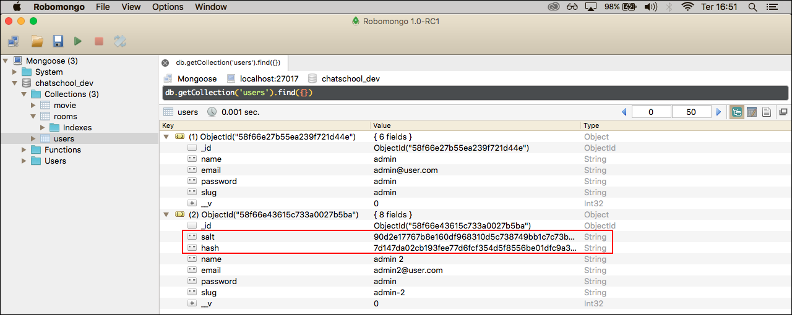

# Login e logout

A maioria dos sistemas possui uma área administrativa e, consequentemente, um sistema de autenticação com login e senha.

Para criarmos o sistema de autenticação, utilizaremos duas bibliotecas que ainda não instalamos. 
No terminal, instalem as seguintes bibliotecas:

```
npm install passport passport-local-mongoose --save
```

Desenvolveremos a autenticação utilizando sessões, de uma maneira muito simples e rápida. Por este motivo, instalamos a biblioteca **express-session**, pois o **passport-local-mongoose** é, totalmente, dependente desta biblioteca.

A configuração será feita no arquivo **src/configs/env/development.js**. Vejam o código adicionado a este arquivo:

```js
// Adicionar junto com as demais constantes
const passport = require('passport')
const LocalStrategy = require('passport-local-mongoose').Strategy

// Adicionar após: mongoose.connect(app.get('mongo_url'))
app.use(passport.initialize())
app.use(passport.session())
passport.use(new LocalStrategy(require('./../../schemas/users').authenticate()))
passport.serializeUser(require('./../../schemas/users').serializeUser())
passport.deserializeUser(require('./../../schemas/users').deserializeUser())
```

Estamos inicializando as bibliotecas passport e express-session, para conseguirmos desenvolver o sistema de login, posteriormente.

Deixamos o passport configurado para podermos utilizar durante o cadastro de um novo usuário e, também, na atualização dos usuários já existentes. 

Após estas configurações, devemos acessar o arquivo **src/schemas/users.js**. Vejam a alteração neste arquivo:

```js
const mongoose = require('mongoose')
const passportLocalMongoose = require('passport-local-mongoose')

const User = new mongoose.Schema({
    name: {
        type: String,
        required: true
    },
    slug: {
        type: String,
        required: true
    },
    email: {
        type: String,
        required: true
    },
    password: {
        type: String,
        required: true
    }
})

User.plugin(passportLocalMongoose, { usernameField: 'email' })

module.exports = mongoose.model('User', User);
```

As alterações estão somente nas duas linhas abaixo:

```js
const passportLocalMongoose = require('passport-local-mongoose')
User.plugin(passportLocalMongoose, { usernameField: 'email' })
```

Carregamos o plugin **passport-local-mongoose**, que é uma extensão do mongoose. Em seguida, informamos que o campo de **usernameField** do plugin será substituído pelo campo de email. Fazemos isso, porque não possuímos um campo de username.

Após a implementação modificaremos, um pouco, o CRUD de users. Vejam as modificações:

```js
// services/users/create.js
const Users = require('./../../schemas/users')

module.exports = (req, res) => {
    req.body.slug = req.body.name.toLowerCase().replace(/ /g, '-')

    Users
        .register(req.body, req.body.password, (err, account) => {
        if (err) {
            return res.send('Error ' + error)
        }

        return res.redirect('/users')
    })
}

// services/users/update.js
const Users = require('./../../schemas/users')

module.exports = (req, res) => {
    Users
        .findById(req.params.id)
        .then((user) => {
        user.password = req.body.password

        user.setPassword(user.password, (err, updated, passErr) => {
            if (err || passErr) {
                return res.send('Error: ' + error)
            }

            user.save()

            user.email = req.body.email
            user.name = req.body.name

            user.save()
            return res.redirect('/users')

            })
        })
        .catch((error) => {
                return res.send('Error: ' + error)
        })
}
```

Observem que os métodos continuam parecidos, porém, quem se encarrega de fazer a persistência no banco de dados são as bibliotecas que instalamos em conjunto com a programação.

Notem que, verificamos o tipo de usuário que está tentando fazer a persistência, usando o código (**req.body.password**). Caso não exista este campo, significa que o usuário não está logado e, consequentemente, não tem acesso e nem permissão, para executar a ação de persistência em banco.

 Utilizamos o método **register** para criação e o método **save** para atualizações. Percebam que estamos utilizando duas vezes o método save, em nosso serviço de update. Não é um erro. Precisamos executar duas vezes, porque o método **setPassword** não suportaria salvar outros dados a não ser a password. Logo, primeiro salvamos o password e em seguida, salvamos os demais campos do schema.

Vejam a diferença entre criar um usuário utilizando as bibliotecas instaladas e sem utilizá-las:



A biblioteca passport, juntamente com passport-local-mongoose, tratam da segurança e criam campos de validações extras. Vejam que não precisamos fazer nada para isso.

## Criando login

Para a criação de login, teremos que manter a mesma regra utilizada até agora. Criaremos o endpoint principal, o arquivo de rotas dentro deste endpoint e as views e os serviços.

Primeiro, criem uma pasta chamada **login** dentro da pasta **src/views**. Em seguida, criem, dentro desta pasta, um arquivo chamado **index.hbs**.

Dentro da pasta **src/routes**, criem uma pasta chamada **login**. Dentro desta pasta, criem um arquivo index.js com o seguinte conteúdo:

```js
const express = require('express')
const router = express.Router();

router.get('/', require('./../../services/login'))

module.exports = router
```

Depois, definiremos o endpoint principal em nosso arquivo **src/index.js**. Vejam o código:

```js
module.exports = (app) => {
    app.use('/', require('./routes/main'))
    app.use('/users', require('./routes/users'))
    app.use('/rooms', require('./routes/rooms'))
    app.use('/login', require('./routes/login'))
}
```

Agora, criem a pasta **login** em **src/services**. Dentro desta pasta, criem o arquivo **index.js** e **login.js**, com os seguintes códigos, respectivamente:

```js
// arquivo index.js
const Users = require('./../../schemas/users')

module.exports = (req, res) => {
    Users
        .authenticate()(req.body.email, req.body.password, (err, user, options) => {
            if (err) {
                return res.send('Error: ' + err)
            }

            return req.login(user, (err) => {
                if (err) {
                    return
                }

                return res.redirect('/')
            })
        })
}
```

```js
// arquivo login.js
const Users = require('./../../schemas/users')

module.exports = (req, res) => {
    Users
        .authenticate()(req.body.email, req.body.password, (err, user, options) => {
            if (err) {
                return res.send('Error: ' + err)
            }

            return req.login(user, (err) => {
                if (err) {
                    return
                }

                return res.redirect('/')
            })
        })
}
```

Desta forma, caso acessem **http://localhost:9000/login**, vocês deverão ser redirecionados para a view de login e, caso adicionem os dados de autenticação corretos, vocês deverão ser redirecionados para a página raiz do sistema de administração. Se houver algum erro de renderização, podem tentar rodar o gulp, novamente, no terminal.

Depois de fazerem o login e estarem autenticados, notem que, qualquer usuário ainda tem acesso a qualquer ponto do sistema, mas isso não é correto. Apenas os usuários, autenticados, deveriam ter este acesso.

Para resolver este problema, criaremos um recurso chamado **middleware**. Criem uma pasta com este nome dentro da pasta **src/routes**. Dentro desta pasta, criem um arquivo chamado **isloggedin.js** e adicionem o seguinte código:

```js
module.exports = (req, res, next) => {
    if (req.user) {
        return next()
    }

    return res.redirect('/login')
}
```

Observem que este código verifica se os dados do usuário existem na requisição. Se existir, ele continua a execução. Caso contrário, ele redireciona para a página de login, obrigando o usuário estar logado, para ter acesso.

Apenas criar este arquivo e adicionar este código, não faz com que o middleware funcione. Precisamos aplicá-lo em nossas rotas.

Aplicaremos na rota **src/main/index.js**, para que vocês tenham o primeiro exemplo de aplicação:

```js
const express = require('express')
const router = express.Router()

const isLoggedIn = require('./../middleware/isloggedin')

router.get('/', isLoggedIn, require('./../../services/main'))

module.exports = router
```

Notem que estamos aplicando o middleware, assim como aplicamos as nossas validações.

Depois aplicarem a rota main, reiniciem o gulp e tentem acessar, novamente, a rota raiz **http://localhost:9000/**. Vocês serão redirecionados para a página de login. Significa que o sistema de autenticação está funcionando. Basta aplicar as demais rotas:

```js
// arquivo src/routes/users/index.js
const express = require('express')
const router = express.Router()

const isLoggedIn = require('./../middleware/isloggedin')

const createRules = require('./../validator/users/create')
const editRules = require('./../validator/users/edit')
const removeRules = require('./../validator/users/remove')
const updateRules = require('./../validator/users/update')

router.get('/', isLoggedIn, require('./../../services/users/index'))
router.get('/new', isLoggedIn, require('./../../services/users/new'))
router.get('/edit/:id', isLoggedIn, editRules, require('./../../services/users/edit'))
router.get('/:id', isLoggedIn, require('./../../services/users/show'))
router.post('/', isLoggedIn, createRules, require('./../../services/users/create'))
router.put('/:id', isLoggedIn, updateRules, require('./../../services/users/update'))
router.patch('/:id', isLoggedIn, updateRules, require('./../../services/users/update'))
router.delete('/:id', isLoggedIn, removeRules, require('./../../services/users/remove'))

module.exports = router

// arquivo src/routes/rooms/index.js
const express = require('express')
const router = express.Router()

const isLoggedIn = require('./../middleware/isloggedin')

const createRules = require('./../validator/rooms/create')
const editRules = require('./../validator/rooms/edit')
const removeRules = require('./../validator/rooms/remove')
const updateRules = require('./../validator/rooms/update')

router.get('/', isLoggedIn, require('./../../services/rooms/index'))
router.get('/new', isLoggedIn, require('./../../services/rooms/new'))
router.get('/edit/:slug', isLoggedIn, editRules, require('./../../services/rooms/edit'))
router.get('/:id', isLoggedIn, require('./../../services/rooms/show'))
router.post('/', isLoggedIn, createRules, require('./../../services/rooms/create'))
router.put('/:id', isLoggedIn, updateRules, require('./../../services/rooms/update'))
router.patch('/:id', isLoggedIn, updateRules, require('./../../services/rooms/update'))
router.delete('/:id', isLoggedIn, removeRules, require('./../../services/rooms/remove'))

module.exports = router
```

Basta rodar o gulp, novamente, para evitar erros e pronto!. Já estamos com todas as rotas protegidas, através deste middleware.

Para termos uma segurança a mais, podemos adicionar um handlebar no arquivo **src/views/partials/main/header.hbs**. Desta forma, ocultaremos o menu principal, caso o usuário não esteja logado. Antes disso, o usuário não tinha acesso, mas ele ainda via as opções possíveis no menu. Com esta adaptação, ele não consegue exergar o menu principal.

```html
<header id="header">
    <nav class="navbar navbar-inverse">
        <div class="container-fluid">
            <div class="nav-header">
                <button type="button" class="navbar-toggle collapsed" data-toggle="collapse" data-target="#nav">
                    <span class="sr-only"></span>
                    <span class="icon-bar"></span>
                    <span class="icon-bar"></span>
                    <span class="icon-bar"></span>
                </button>
                <a href="/" class="navbar-brand">ChatSchool</a>
            </div>
            {{#if user_logged}}
                <div class="collapse navbar-collapse" id="nav">
                    <ul class="nav navbar-nav">
                        <li class="active">
                            <a href="/">Home</a>
                        </li>
                        <li class="dropdown">
                            <a data-toggle="dropdown" class="dropdown-toggle" href="">
                                Users
                                <span class="caret"></span>
                            </a>
                            <ul class="dropdown-menu">
                                <li>
                                    <a href="/users">List</a>
                                    <a href="/users/new">Create</a>
                                </li>
                            </ul>
                        </li>
                        <li class="dropdown">
                            <a data-toggle="dropdown" class="dropdown-toggle" href="">
                                Rooms
                                <span class="caret"></span>
                            </a>
                            <ul class="dropdown-menu">
                                <li>
                                    <a href="/rooms">List</a>
                                    <a href="/rooms/new">Create</a>
                                </li>
                            </ul>
                        </li>
                    </ul>
                </div>
            {{/if}}
        </div>
    </nav>
</header>
```

Reparem no handlebar **{{#if user_logged}} {{/if}}**.

Verificamos se existe uma variável com o nome de **user_logged**. Se existir, ele exibe o menu. Caso não exista, o menu estará oculto. Ainda não criamos esta variável e não atribuímos nenhum valor a ela.

Teremos que passar esta variável, como parâmetro, para todas as views que renderizam o menu, para que o menu seja exibido. Passamos estes valores para as views, através dos serviços.

```js
// src/services/main/index.js
module.exports = (req, res) => {
    return res.render('main/index', {
        title: 'Chatschool - Admin',
        user_logged: req.user
    })
}

// src/services/users/index.js
return res.render('users/index', {
    title: 'Users - ChatSchool Admin',
    users,
    user_logged: req.user
})

// src/services/users/edit.js
return res.render('users/edit', {
    title: 'Users - ChatSchool Admin',
    user,
    user_logged: req.user
})

// src/services/users/new.js
return res.render('users/create', {
    title: 'Users - Chatschool Admin',
    user,
    user_logged: req.user
})

// src/services/rooms/index.js
return res.render('rooms/index', {
    title: 'Rooms - ChatSchool Admin',
    rooms,
    user_logged: req.user
})

// src/services/rooms/edit.js
return res.render('rooms/edit', {
    title: 'Rooms - ChatSchool Admin',
    room,
    user_logged: req.user
})

// src/services/rooms/new.js
return res.render('rooms/create', {
    title: 'Rooms - ChatSchool Admin',
    room,
    user_logged: req.user
})
```

Adicionando a variável em todas as rotas, temos o sistema todo protegido de usuários não autenticados.

Agora, podemos dar continuidade ao desenvolvimento do chat.