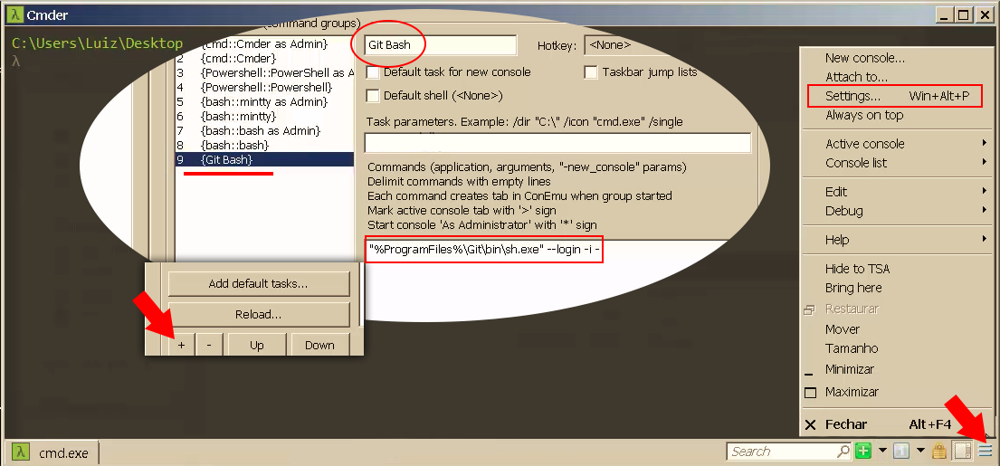

# Windows - Instalando Git Bash e cmder

Este módulo da início a configuração do ambiente de desenvolvimento no sistema operacional Windows.

Quando se trabalha com Windows e tem um ambiente mal configurado você pode se deparar com muitos erros ou conflitos. Começa a ver falta de arquivos de extensão **dll** e pode começar a ver muitos outros erros, então vale a pena configurar corretamente o ambiente para não desanimar dos projetos logo no início deles.

Quando o projeto começa a ser desenvolvido o ambiente deve estar 100% configurado para que você gaste suas energias programando e não se preocupando com o ambiente em que está desenvolvendo. Este conceito se aplica para qualquer linguagem que for desenvolver.

Com o novo PHP você não precisa mais instalar alguns programas que criavam o ambiente para o desenvolvimento como:

* MAMP
* WAMP
* XAMPP

Atualmente você pode trabalhar com diversas versões do PHP instalando-as diretamente em sua máquina, de forma muito fácil e rápida. Então você pode começar a se desprender da dependência destes programas. Claro que ainda pode utilizar ou instalar o apache juntamente com o PHP, mas lembrando sempre que é possível criar os ambientes sem precisar de outros programas.

Neste projeto não utilizaremos o apache porque utilizaremos o servidor embutido do PHP, então precisaremos instalar apenas o PHP em nossa máquina.

Outro problema, ao trabalhar com Windows, são os terminais nativo. O Windows possui dois terminais nativos:

1. cmd
2. Powershell

Você pode utilizar qual terminal achar melhor, mas aconselhamos o uso de dois terminais que podem ser instalados em sua máquina. Caso não queira instalar outro terminal e decidir utilizar os terminais nativos, escolha o **Powershell**.

Se você quer entrar no mundo do desenvolvimento, aconselhamos começar a olhar os terminais como um ambiente Linux. Os terminais que indicaremos trabalham com a mesma estrutura Linux e por este motivo é muito melhor para ser utilizado durante o desenvolvimento. Em palavras mais simples você poderá ter terminais que rodam comandos Unix dentro do seu Windows.

### Git Bash

O Git Bash já vem com o **Git** integrado e podemos emular comandos Unix normalmente. É possível criar e excluir pastas e arquivos através de comandos iguais aos utilizados nos ambientes Unix.

Outro recurso que você pode utilizar, caso esteja utilizando o Windows 10, é rodar o Ubuntu nativamente dentro do seu Windows. Você pode pesquisar na internet como fazer esta simulação de ambiente Linux, ativando o modo de desenvolvedor. Caso opte por este recurso não precisaria instalar o Git Bash, mas instalar o Git Bash pode ser mais simples e produtivo no momento.  

O Git Bash não precisa ser utilizado somente no Windows, é possível utilizá-lo também em ambientes Linux.

Para instalar você pode acessar o site abaixo:

<https://git-for-windows.github.io/>

A instalação é muito simples, como se fosse qualquer outro programa a ser instalado. Mantenha as configurações padrões de instalação porque será perfeita para o desenvolvimento do projeto proposto.

Depois de instalar você pode abrir e rodar alguns comandos para testar e comprovar que os comando são mesmo do Linux. Exemplos:

| Comando      | Descrição                                             |
|--------------|-------------------------------------------------------|
| ls           | Lista todos os arquivos e pastas do local que estiver |
| mkdir teste  | Cria uma pasta chamada teste                          |

Lembrando que a barra utilizada no terminal do Windows é invertida já no Git Bash é a mesma barra utilizada para datas.

| Sistema Operacional | Barra |
|---------------------|-------|
| Windows             | \     |
| Linux               | /     |

### Cmder

Este terminal é muito bom pelo fato de aceitar outros terminais encapsulados dentro dele. É possível trabalhar com o Git Bash dentro do Cmder, caso queira.

Você pode também trabalhar com diversas abas e alterar cores de exibição.

Para instalar você pode acessar o site abaixo:

<http://cmder.net/>

Existem dois tipos de download:

1. mini
2. full

A versão full possui o Git também.

Depois de baixar basta extrair os arquivos para algum local de sua máquina. Indicamos que seja movido para o diretório **C:**, mas fique a vontade para colocar onde desejar. Depois de mover pode adicionar um atalho para onde achar melhor.

Quando abrir pela primeira vez o terminal **cmder** terá que selecionar a opção **Unlock and Continue**, para que ele libere o **ConEmu**. O cmder trabalhar com este terminal por trás, que é responsável por fazer o trabalho pesado.

Depois de instalar o terminal você poderá rodar qualquer comando unix, da mesma forma que o Git Bash.

O terminal nativo do cmder é híbrido, ou seja, ele roda tanto comandos DOS quanto unix. Você pode rodar **dir** ou **ls**, ambos listarão arquivos e pastas presentes no local que estiver, mesmo sendo de bases diferentes.

Caso queira integrar outro terminal ao cmder siga os passos abaixo:

1. Clique no botão de 3 barras no canto inferior direito do terminal cmder
2. Clique em Settings
3. Selecione a opção task no menu lateral esquerdo
4. Adicione a nova task no símbolo de adição
5. Adicione o nome da task
6. Adicione o caminho para o arquivo executável

Veja a imagem abaixo:

Você pode abrir outros tipos de terminais, que já são nativos de instalação. Veja imagem abaixo:

Agora basta escolher qual terminal utilizar durante o desenvolvimento.