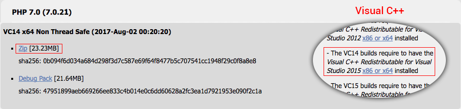

# Windows - Instalando PHP e Composer

Neste módulo você aprenderá a instalar e configurar o PHP e o Composer em sua máquina.

Como foi falado anteriormente, você não precisa mais instalar ferramentas que possuam um pacote com PHP e Apache, para desenvolver seus projetos, a menos que seu projeto exija tais configurações. 

Para nosso projeto não será necessário o uso do Apache, somente o PHP será suficiente para subir a aplicação, utilizando o servidor embutido.

### Instalando o PHP

Premissas Importantes

1. Windows 7, no mínimo, instalado em sua máquina
2. No mínimo, a atualização Service Pack 1 instalada. 

Caso não tenha as condições acima, quando for rodar o PHP haverá um erro.

O projeto será desenvolvido utilizando o PHP 7.0, porque em breve o Laravel lançará a versão 5.5 que exigirá a versão mínima do PHP como 7.0.

Para instalar o PHP acesse o link abaixo:

<http://windows.php.net/download/>

A versão instalada será a **PHP 7.0 (7.0.22)**, que é a última disponível no momento da criação do conteúdo. Veja imagem abaixo:



Fique atento em relação a versão que você instalará. Caso tenha o Windows 32 bits, instale a versão x86. Se for 64 bits instale o x64.

Não existe muita diferença entre a versão **Thread Safe** e **Non Thread Safe**, a não ser que fosse trabalhar com servidor web, que no caso seria o Apache. Para nosso projeto, instalaremos a versão Non Thread Safe, como você pode ver na imagem acima.

É necessário que o Visual C++ esteja instalado na máquina. Na imagem acima também mostramos a versão a ser instalada e você pode encontrar na barra lateral esquerda do mesmo site, indicado acima.

Extraia o arquivo zip com a linguagem PHP para uma pasta chamada **php**, depois de extrair você moverá a pasta para o local de sua preferência. Nós indicamos que seja colocado no diretório **C:**.

Caso queira ter mais de uma versão do PHP instalada em sua máquina, basta entrar na pasta e renomear o executável. Veja exemplos abaixo:

* php56.exe
* php70.exe

Depois de renomear, bastar adicionar cada um deles às suas variáveis de ambiente. Que será o próximo passo que executaremos.

Para configurar o php é necessário apontar a versão do php nas variáveis de ambiente.

1. Acesse **Painel de Controle/Sistema/Configurações Avançadas do Sistema/Variáveis de Ambiente**.
2. Acesse a aba **Avançado** e nesta aba existe uma sessão chamada **Variáveis do sistema**. 
3. Encontre uma variável chamada **Path** e adicione o caminho da pasta onde moveu o seu PHP, caso tenha mais do que uma versão, você deverá adicionar todas que desejar.

O que separa um caminho de outro para as variáveis de ambiente é o símbolo **ponto e vírgula(;)**, portanto vá até o final das variáveis que já existem, adicione o ponto e vírgula e depois acrescente o caminho da pasta do seu PHP.

Exemplo:

**C:\cmder;C:\php**

No exemplo acima tem a variável de ambiente configurada para o terminal **cmder** e logo depois a variável de ambiente para o **php**.

O seu sistema operacional rastreará todas as pastas adicionadas a esta variável *Path* até encontrar o arquivo executável dentro delas.

Depois de realizar este procedimento, abra o seu terminal e rode o comando abaixo:

```sh
php -v
```

Você deverá obter como resultado a versão do PHP que você instalou, no caso **PHP 7.0 (7.0.22)**.

### Configurando o php.ini

Acesse a pasta php que você extraiu anteriormente e procure por dois arquivo.

1. php.ini-development
2. php.ini-production

Neste momento você deve decidir qual configuração utilizar. Como estamos desenvolvendo, escolheremos a primeira opção e para ativar esta configuração devemos renomear o arquivo, retirando o sufixo **-development** deixando apenas **php.ini**.

Este é o arquivo de configuração do php e deveremos abrí-lo para configurar o php.

Veja a tabela de configurações abaixo. Encontre as variáveis e certifique-se de que estão com os valores da tabela.

| Variável | Valor |
|------|------|
| error_reporting         | E_ALL  |
| display_errors          | On     |
| display_startup_errors  | On     |
| realpath_cache_size     | 4096k     |
| extension_dir           | "ext"     |

Além de conferir os valores acima para as variáveis, você deve verificar se o código não está comentado. Para comentar no arquivo php.ini usa-se o símbolo ponto e vírgula. Portanto, se estiver com um ponto e vírgula na frente da linha, quer dizer que a linha não tem validade alguma na configuração, pois está comentada.

Caso as variáveis acima estejam com ponto e vírgula na frente, não esqueça de removê-las.

Você precisará remover o ponto e vírgula da frente, caso exista, de algumas extensões que estão listadas abaixo:

* extension=php_curl.dll
* extension=php_fileinfo.dll
* extension=php_intl.dll
* extension=php_mbstring.dll (importante para o Laravel)
* extension=php_exif.dll
* extension=php_openssl.dll
* extension=php_pdo_mysql.dll
* extension=php_pdo_sqlite.dll

Após realizar estas alterações salve o arquivo, vá até o terminal e rode o comando abaixo:

```sh
php -m
```

Você não poderá ter nenhum erro e deverá ter todas as extensões que estão habilitadas em seu php, inclusive as listadas acima.

### Instalando Composer

O composer é o gerenciador de pacotes da linguagem PHP.

Atualmente, trabalhar sem o composer prejudica a produtividade e você acaba trabalhando de forma braçal. Com o composer os programadores ganham mais organização, facilidade e produtividade.

O uso do composer se tornou, praticamente, obrigatório em projetos PHP. Os maiores e mais importantes frameworks utilizam o composer e isso faz dele um padrão para desenvolvimento de aplicações em PHP.

Para instalar o Composer acesse o site abaixo:

<https://getcomposer.org/download/>

Basta baixar o instalador e executar de forma global. Você pode também baixar o arquivo **composer.phar** e adicioná-lo na pasta raiz de cada projeto que for iniciar. Indicamos que instale de forma global, assim poderá utilizar o gerenciador independente da existência ou não do arquivo **.phar** no projeto.

Ao executar o instalador, clique em avançar e na segunda tela ele deverá reconhecer as versões do PHP instaladas em seu computador. É muito importante que ele reconheça e que você selecione a versão correta com que ele será executado. Em nosso caso a versão 7.0.

Na segunda tela ele deverá reconhecer as configurações do seu PHP e na terceira tela você poderá informar o **proxy**. Caso esteja trabalhando em sua empresa é importante que informe para que não trave durante a execução. Se for sua máquina local, não será necessário a menos que utilize algum proxy.

Depois, basta finalizar a instalação e o composer já estará disponível no terminal.

Para ter certeza que foi instalado corretamente, basta acessar o terminal e rodar o comando **composer**. Você deverá obter os comandos do composer como resposta.

Com estes passos, o ambiente já possui o php e o composer instalados e devidamente configurados.

No próximo módulo faremos a instalação e configuração do banco de dados.


