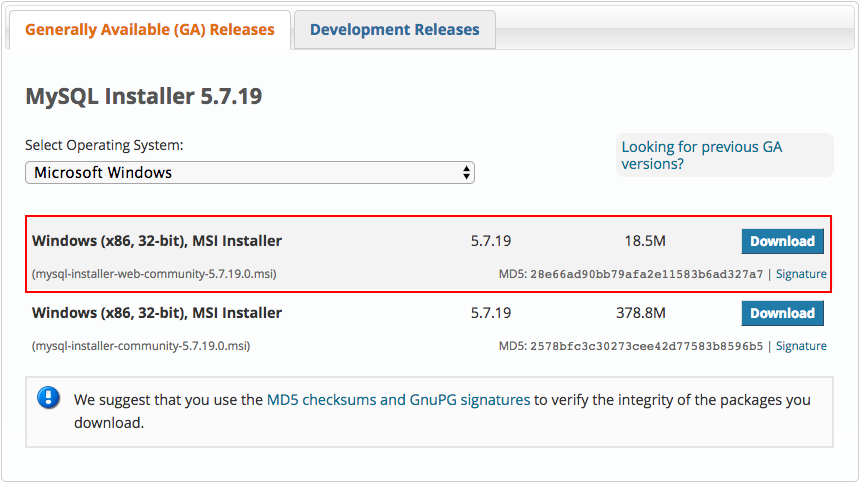
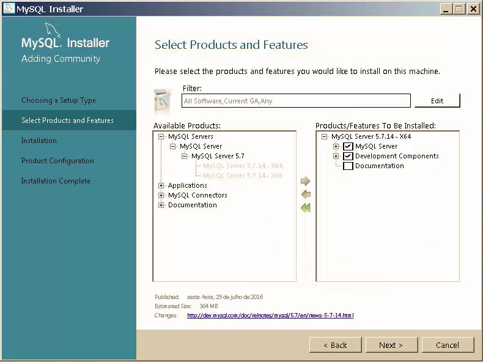
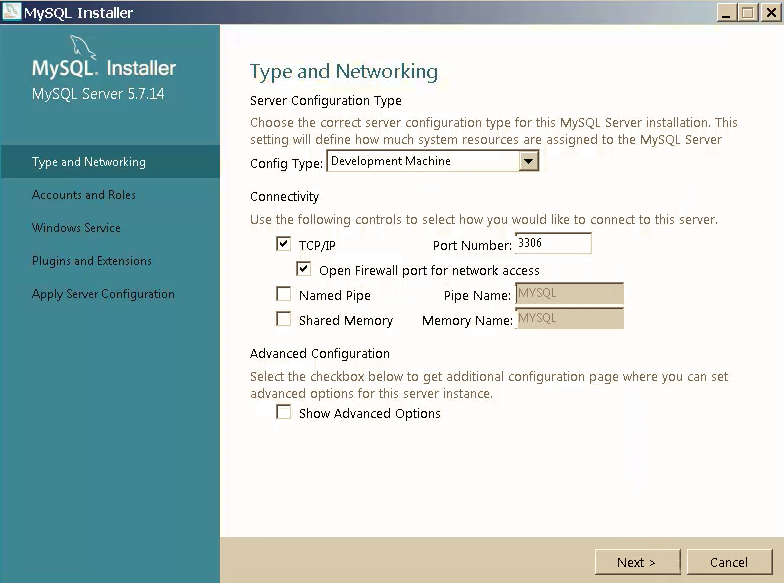
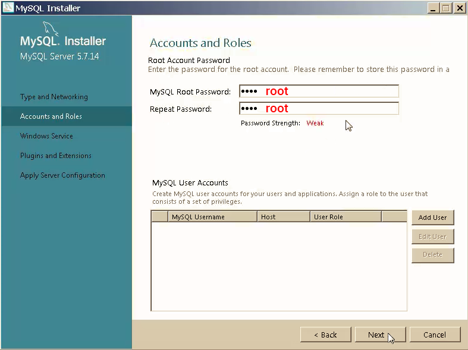
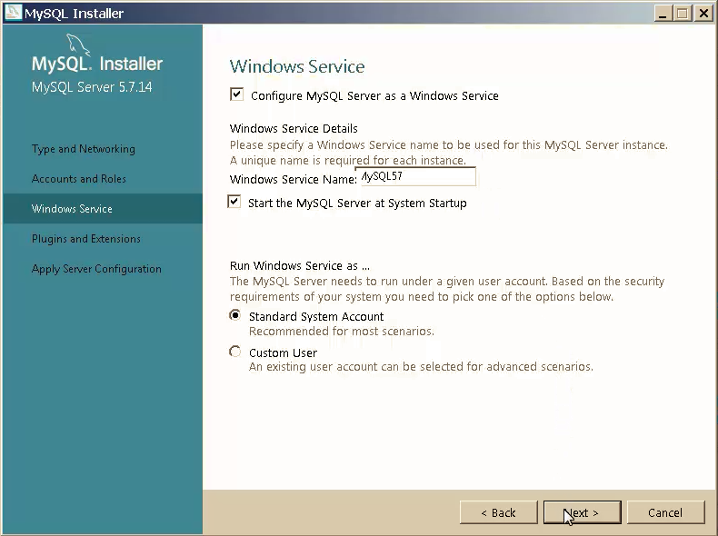
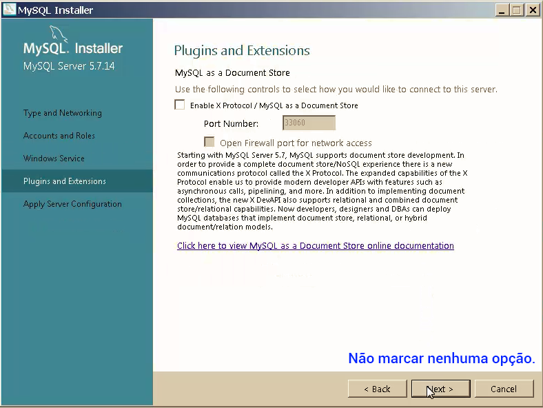
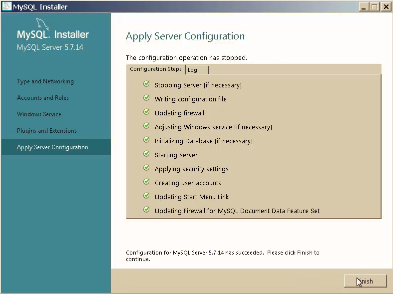
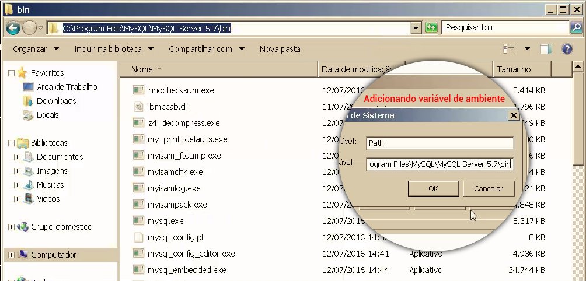

# Windows - Instalando MySQL Server

No projeto que desenvolveremos utilizaremos o banco de dados MySQL, portanto você deverá instalar em sua máquina.

Existem duas opções:

1. Baixar o instalador somente do banco de dados
2. Baixar a ferramenta mysql installer

O MySQL não possui somente o servidor de banco de dados, possui também o **MySQL Workbench**, entre outras ferramentas que estarão diponíveis para instalação, caso necessite.

Para fazer o download do instalador acesse o site abaixo:

<https://dev.mysql.com/downloads/installer/>

Existem duas instalações, uma mais leve para quem quer instalar somente o banco de dados e outra maior onde você poderá escolher outras ferramentas do MySQL. Optaremos pela primeira. Desta maneira cumprimos nosso objetivo, que é instalar o banco de dados e não ocupamos espaço desnecessário na máquina.



Após fazer o download, abra o instalador e selecione a opção **Custom**, para selecionar o que realmente queira instalar.

Ao clicar em Custom, virão todas as ferramentas selecionadas, remova todas e selecione apenas o que achar necessário para seu projeto. Fique atento sempre à sua arquitetura de sistema operacional se é 32 ou 64 bits.



Durante a instalação, caso você não tenha o Visual C++ 2013 instalado, ele poderá pedir para que instale. Não haverá problema, você poderá instalar e depois voltar para a instalação do banco de dados, normalmente.

Após a instalação, você deverá configurar o banco de dados. Existem informações muito importantes como porta, usuário e senha.











Você pode instalar a ferramenta Workbench, que serve para administrar suas instâncias e fazer modelagens de banco de dados. Existem outras ferramentas de outras empresas, mas esta é a ferramenta oficial.

### Testando ambiente

Com o PHP e o MySQL instalados e com as outras ferramentas, já possuímos nosso ambiente pronto para rodar uma aplicação Laravel. Faremos a instalação para testar nosso ambiente.

Para criar uma aplicação Laravel rode o comando abaixo, no terminal:

```sh
composer create-project --prefer-dist laravel/laravel laravel_test
```

Este comando fará o download dos arquivos que compõem o Laravel, dando preferência para a versão estável. O nome dado a pasta do projeto é o último parâmetro e terá o nome de **laravel_test**.

Para testar completamente, criaremos um usuário e gravaremos no banco de dados para ter certeza de que temos um ambiente devidamente configurado.

Depois de ter rodado o comando acima, acesse a pasta **laravel_test** e rode o comando abaixo:

```sh
php artisan serve
```

Este comando subirá a aplicação e você poderá acessar no navegador a url **localhost:8000** e deverá ter a aplicação funcionando.


Edite o arquivo **.env**, que está na pasta raiz do projeto para os dados abaixo:

```
DB_CONNECTION=mysql
DB_HOST=127.0.0.1
DB_PORT=3306
DB_DATABASE=laravel_test
DB_USERNAME=root
DB_PASWORD=root
```

Veja que colocamos o banco de dados como sendo laravel_test, mas ainda não o criamos, basta criar este banco de dados. Configuramos o usuário como root e a senha também, assim como acabamos de configurar no mysql.

Para criar o banco de dados, você pode utilizar uma ferramenta gráfica como o Workbench, ou criar pelo terminal. Indicamos que comece a trabalhar mais com o terminal para que consiga evoluir como desenvolvedor.

Para acessar o mysql via terminal você precisará adicionar o mysql nas variáveis de ambiente do Windows, assim como fez com o PHP. Caso tenha alguma dúvida, volte ao processo indicado no módulo anterior.

Acesse a pasta de instalação do MySQL em sua máquina, de acordo com o seu sistema operacional, copie o caminho da pasta binária e adicione nas variáveis de ambiente.



Após configurar a variável de ambiente acesse o terminal novamente e rode os comandos abaixo:

```sh
mysql -version

mysql -uroot -proot

create database laravel_test;

exit
```

1. Mostra a versão do mysql instalada e ativa.
2. Acessa o serviço do mysql(onde pode gerenciar as instâncias pelo terminal).
	* -u - Usuário
	* -p - Password
3. Comando para criar um banco de dados.
4. Finaliza o serviço.

Depois de criar o banco de dados, acesse a pasta raiz do projeto e rode o comando abaixo:

```sh
php artisan migrate
```

Caso queria criar novamente as tabelas, basta rodar o comando abaixo:

```sh
php artisan migrate:refresh
```

Com o comando acima as tabelas nativas do Laravel foram criadas, caso tivesse algum erro de configuração de banco de dados, haveria retorno de erro. Caso tenha rodado sem erros a configuração está toda correta.

Para criar um novo usuário podemos utilizar o próprio console do Laravel, que se chama **tinker**. Rode os comandos abaixo:

```sh
php artisan tinker

App\User::create(['name' => 'test', 'email' => 'teste@test.com', 'password' => '123']);
```

Você deverá ter uma resposta como esta:

```
=> App\User {#731
     name: "test",
     email: "teste@test.com",
     updated_at: "2017-08-09 18:47:23",
     created_at: "2017-08-09 18:47:23",
     id: 1,
   }
```

Isso quer dizer que já conseguiu gravar o primeiro dado no banco de dados e que o ambiente está devidamente configurado para iniciarmos o desenvolvimento do projeto.