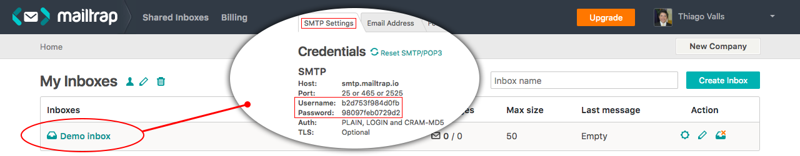

 Testando envio de email de boas-vindas

Antes de testarmos o envio de email, temos que criar o campo checkbox, para que seja selecionado caso o administrador resolva enviar um email de boas-vindas ao novo usuário.

Abra o arquivo **/app/Forms/UserForm.php**.

```php
public function buildForm()
{
    $id = $this->getData('id');
    $this
        ->add('name', 'text', [
            'label' => 'Nome',
            'rules' => 'required|max:255'
        ])
        ->add('email', 'email', [
            'label' => 'E-mail',
            'rules' => "required|max:255|unique:users,email,{$id}"
        ])
        ->add('send_mail', 'checkbox', [
            'label' => 'Enviar e-mail de boas vindas',
            'value' => true,
            'checked' => false
        ]);
}
```

Após adicionar o campo, temos que avaliar se o mesmo foi marcado ou não durante a criação do usuário.

Abra o arquivo **/app/Models/User.php**.

```php
    public static function createFully($data)
    {
        $password = str_random(6);
        $data['password'] = $password;
        /** @var User $user */
        $user = parent::create($data+['enrolment' => str_random(6)]);
        self::assignEnrolment($user, self::ROLE_ADMIN);
        $user->save();
        if(isset($data['send_mail'])){
            $user->notify(new UserCreated());
        }
        return $user;
    }
```

Depois que o método createFully salva os dados no banco, verificamos se o campo send_mail está presente no array **$data**. Caso esteja selecionado, o email é enviado, caso contrário nada é feito.

Para testar o envio de email não é necessário adicionar suas credenciais de algum servidor de email. Já existem serviços que nos auxiliam fazer estes testes sem que seja necessário ficar expondo nossos dados de e-mail.

O Laravel já tem integração com um serviço chamado **mailtrap**. Para utilizar este serviço basta fazer um cadastro no site do mailtrap ou logar com **gmail** ou **github**, caso possua uma conta nestes serviços.

Após fazer o login no serviço, você terá acesso à uma caixa de email que, geralmente, tem o nome de **Demo inbox**. Clique sobre esta caixa de email para ter acesso aos dados de configuração **SMTP**.



Você pode utilizar o serviço em diversas outras linguagens. No próprio site você encontra as configurações necessárias.

Precisaremos apenas do **Username** e **Password**, para enviar a notificação teste.

Abra o arquivo **/.env** e adicione estes dados.

```
MAIL_DRIVER=smtp
MAIL_HOST=smtp.mailtrap.io
MAIL_PORT=2525
MAIL_USERNAME=b2d753f984d0fb
MAIL_PASSWORD=98097feb0729d2
MAIL_ENCRYPTION=null
```

Veja que por padrão o **MAIL_HOST** já vem configurado para o serviço do mailtrap. Basta modificar o usuário e senha, que você pegará no seu painel, segundo imagem acima.

Depois de informar usuário e senha, basta criar um novo usuário e verificar o envio de email no painel do mailtrap.

Observe que o template padrão é simples e já vem todo configurado com o assunto em negrito, as linhas estão já separadas e formatadas. Ganhamos muito tempo pelo fato do Laravel já trazer esta funcionalidade pronta.

O próximo passo será trabalhar na questão da senha do usuário. Enviaremos um link de recuperação de senha para que ele possa acessar e informar sua própria senha.