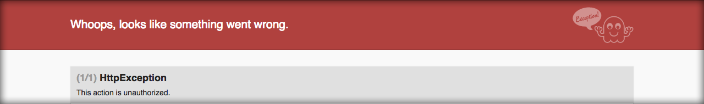

# Protegendo login e área administrativa

Já criamos os tipos de usuários e temos alguns usuários de teste. Podemos partir para a proteção da área administrativa, garantindo que ela seja acessada somente por usuários administradores.

Para fazermos este processo, basta acrescentar um campo na verificação do método **credentials**, que está presente no **loginController**.

Abra o arquivo **/app/Http/Controllers/Auth/LoginController.php**.

```php
protected function credentials(Request $request)
{
    $data = $request->only($this->username(), 'password');
    $usernameKey = $this->usernameKey();
    $data[$usernameKey] = $data[$this->username()];
    $data['userable_type'] = Admin::class;
    unset($data[$this->username()]);
    return $data;
}
```

Observe que, ao invés de dois campos passarem pela validação, serão três campos avaliados: **username**, **userable_type** e **password**.

Crie, manualmente, usuários de todos os tipos e tente fazer o login. Percebam que somente os usuários que são administradores conseguirão logar.

### Protegendo rota administrativa

Em qualquer sistema existe uma diferença entre autenticação e autorização. Para que o sistema **autorize** alguém acessar alguma rota o usuário tem que estar **autenticado** obrigatoriamente. Não há a possibilidade de autorizar ninguém sem autenticação.

O Laravel trabalha com os dois recursos de proteção.

Criaremos uma **autorização** para a área administrativa. No Lavavel uma autorização é definida como uma habilidade que determinado tipo de usuário possui ou não.

Abra o arquivo **/app/Providers/AuthServiceProvider.php**. Neste arquivo criaremos as habilidades necessárias para proteger determinadas rotas.

```php
public function boot()
{
    $this->registerPolicies();

    \Gate::define('admin', function($user) {
        return $user->userable instanceof Admin;
    });
}
```

Utilizamos a façade **Gate** para definir uma habilidade chamada **admin**, que recebe uma função com a regra de autorização. Se a propriedade **userable** do usuário for uma instância de Admin, ele retorna autorizando o acesso. Caso contrário retorna false e o acesso é bloqueado.

#### Aplicando habilidade às rotas

Abra o arquivo **/routes/web.php**.

```php
Route::get('/', function () {
    return view('welcome');
});

Route::prefix('admin')->group(function (){
    Auth::routes();

    Route::group([
        'namespace' => 'Admin\\',
        'as' => 'admin.',
        'middleware' => ['auth', 'can:admin']
    ], function (){
        Route::name('dashboard')->get('/dashboard', function () {
            return "Estou no Dashboard";
        });
        Route::group(['prefix' => 'users', 'as' => 'users.'], function (){
           Route::name('show_details')->get('show_details', 'UsersController@showDetails');
        });
        Route::resource('users', 'UsersController');
    });
});


Route::get('/home', 'HomeController@index')->name('home');
```

Antes de aplicar a alteração acima, tínhamos um **middleware** aplicado às nossas rotas, que era o middleware de autenticação(auth).

Para aplicar mais de um middleware a um grupo de rotas, precisamos passar um array com todos eles.

```php
'middleware' => ['auth', 'can:admin']
```

Veja que estamos aplicando o middleware **auth** e **can**.

O middleware can exige uma habilidade. Para passar a habilidade a ser testada, temos que adicionar dois pontos(:) e o nome de registro da habilidade, como no exemplo acima.

Depois de fazer estas alterações, basta fazer um teste de acesso. Comente o código de autenticação que fizemos no início do módulo e faça o login como um professor ou aluno. O login será autorizado, momentaneamente, e você terá acesso ao template **Welcome**. Em seguida, tente acessar a listagem de usuários e verá que o acesso será bloqueado.

Comentando código de restrição de autenticação

```php
protected function credentials(Request $request)
{
    $data = $request->only($this->username(), 'password');
    $usernameKey = $this->usernameKey();
    $data[$usernameKey] = $data[$this->username()];
    //$data['userable_type'] = Admin::class;
    unset($data[$this->username()]);
    return $data;
}
```

Erro logando com qualquer usuário que não seja administrador:



Após fazer os testes não esqueça de descomentar o código de restrição, pois o login deverá ser feito apenas por administradores.

Depois das alterações, temos o login e a área administrativa protegidos.