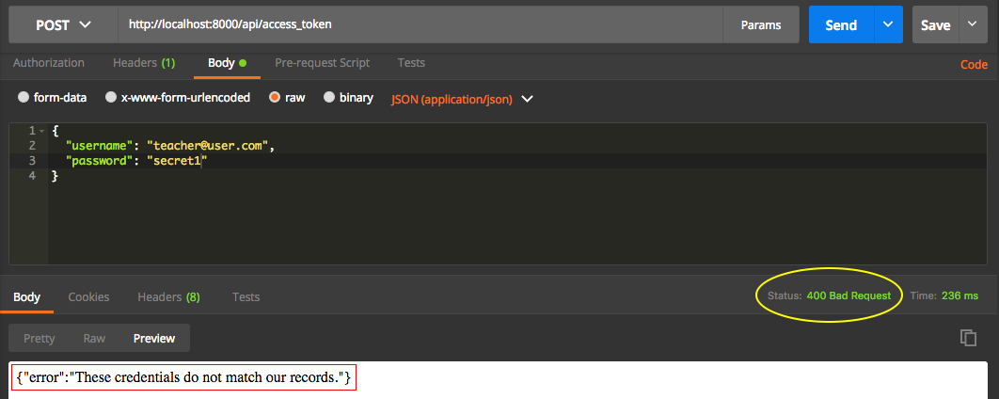

# Resposta de erro ao requisitar token

No módulo anterior criamos um token JWT com sucesso, mas não tratamos a lógica em casos de falha.

Para isso vamos alterar o método **accessToken** no arquivo **/app/Http/Controllers/Api/AuthController.php**.

```php
public function accessToken(Request $request)
{
    $this->validateLogin($request);

    $credentials = $this->credentials($request);

    if($token = \Auth::guard('api')->attempt($credentials)){
        return ['token' => $token];
    }

    return response()->json([
       'error' => \Lang::get('auth.failed')
    ], 400);
}
```

Estamos retornando um erro no formato json e utilizando a própria mensagem de erro do Laravel, através da façade **Lang**. Veja que utilizamos a façade passando o nome do arquivo, seguido da mensagem registrada no mesmo.

Caso queira conferir as mensagens, abra o arquivo **/resources/lang/en/auth.php**.

Estamos passando um status code 400, para informar que foi um erro de requisição de dados do usuário. Trabalhamos com status code, por utilizar o padrão REST e isso exige que trabalhemos da maneira mais semântica possível. Caso tenha dúvidas, você pode pesquisar mais sobre status code para que seus erros ou sucessos sejam o mais corretos possíveis.

Após realizar esta alteração, você pode enviar uma outra requisição de teste, com algum dado errado. Veja a imagem abaixo com a mensagem de erro e o status code.



No próximo módulo falaremos sobre o **logout** da aplicação.