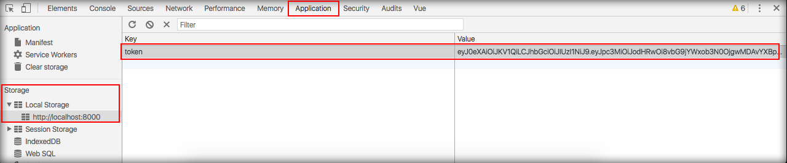

# Armazenando token JWT no local storage

No módulo anterior fizemos um teste para requisitar o token na API e tivemos sucesso na requisição.

O próximo passo será gravar este token no local storage do browser, pois a cada requisição feita precisaremos passar esta informação no header.

O local storage é o mais indicado para se guardar porque não existe tempo de validade, ou seja, o token será válido até que nossa aplicação faça a alteração ou o usuário limpe os dados do navegador.

O fato de trabalhar com token deixa o cliente livre para consumir os dados da API de qualquer tipo de aplicação desenvolvida, tirando a necessidade de se trabalhar com cookies e sessões. Até mesmo uma aplicação desktop poderá consumir dados da API, basta que ele passe o token na requisição.

Se exigíssemos que a aplicação utilizasse sessões e cookies, estaríamos saindo da arquitetura REST e limitando as aplicações que poderiam se comunicar com a API. Suponha que algum desenvolvedor queira criar um aplicativo mobile híbrido e trabalhe com o Cordova no desenvolvimento. Dependendo da versão do Cordova ele não terá o recurso de sessão no tablet, iPad ou Smartphone. Portanto, ele não conseguirá desenvolver um aplicativo para consumir a nossa API.

Em nossa aplicação não exigimos um local específico para o token ser gravado, apenas exigimos que o mesmo seja passado nas requisições.

Para gravar o token no local storage, siga os passos, abaixo.

Criaremos um serviço para fazer toda manipulação do token. Crie e abra o arquivo 

**/resources/assets/spa/js/services/jwt-token.js**.

```js
import {Jwt} from './resources';
import LocalStorage from './localstorage';

export default {
    get token() {
        return LocalStorage.get();
    },
    set token(value) {
        LocalStorage.set('token', value);
    },
    accessToken(username, password){
        return Jwt.accessToken(username,password)
            .then((response) => {
                this.token = response.data.token;
            })
    },
    revokeToken(){

    }
};
```
Observe a sequencia:

1. O método get, set e o accessToken sendo exportados 
2. O método get pega o token
3. O método set atribui um valor ao token, gravando no local storage.  
4. O método accessToken requisita um token e caso tenha sucesso, utiliza o método set para gravar o mesmo no local storage.

O método accessToken, que está no código acima, substituirá o método com o mesmo nome que está no arquivo **/resources/assets/spa/js/services/resources.js**.

Poderíamos fazer a atribuição e a leitura diretamente neste serviço, mas utilizamos outro serviço para facilitar e padronizar este processo. Portanto, crie o serviço **/resources/assets/spa/js/services/localstorage.js** e adicione o seguinte conteúdo.

```js
export default {
    set(key, value){ //string, inteiro, boolean
        window.localStorage[key] = value;
        return window.localStorage[key];
    },
    get(key, defaultValue = null){ //string, inteiro, boolean
        return window.localStorage[key] || defaultValue;
    },
    setObject(key, value){
        window.localStorage[key] = JSON.stringify(value);
        return this.getObject(key);
    },
    getObject(key){
        return JSON.parse(window.localStorage[key] || null);
    },
    remove(key){
        window.localStorage.removeItem(key);
    }
}
```

Os métodos estão prontos para serem utilizados e você pode levar este serviço para qualquer outra aplicação que trabalhe com token e utilize o local storage para o armazenamento.

| Método    | Descrição |
|-----------|------|
| set       | Adiciona o token no local storage do browser de acordo com a chave e o valor informado |
| get       | Pega o valor do local de acordo com a chave informada |
| setObject | Transforma o formato JSON em string para conseguir gravar no local storage |
| getObject | Transforma o valor do local storage em um JSON, fazendo o processo inverso ao método anterior |
| remove    | Remove o token do local storage |

Caso não entenda os métodos do serviço localstorage, acesse o conteúdo de **Autenticação com Vue.js**. Neste conteúdo criamos este serviço e explicamos passo a passo o funcionamento do mesmo.

Após realizar estas criações e alterações, precisamos mudar o modo de chamar os métodos em nosso armazém, pois utilizaremos o nosso serviço para fazer todo o trabalho de controle de tokens. 

Abra o arquivo **/resources/assets/spa/js/store/auth.js**.

```js
import JwtToken from '../services/jwt-token';

const state = {
    user: null,
    check: null
};

const mutations = {
    authenticated(state){

    },
    unauthenticated(state){

    }
};

const actions = {
    login(context, {username, password}){
        return JwtToken.accessToken(username, password);
    },
    logout(){
        return JwtToken.revokeToken();
    }
};

const module = {
    namespaced: true,
    state, mutations, actions
};

export default module;
```

Iniciamos o arquivo carregando o serviço e depois alteramos as actions. Desta forma, realizamos o mesmo procedimento porém através do serviço que criamos neste módulo.

Assim, temos uma aplicação mais estruturada e você pode fazer o teste de login para verificar a gravação do token no local storage do seu navegador.

Acesse o link **http://localhost:8000/app#/login** e efetue o login. Não esqueça de abrir o developer tools e acessar a sessão **Application** e depois acessar o local storage da url que estamos acessando. Você poderá comprovar o token sendo gravado com sucesso.

