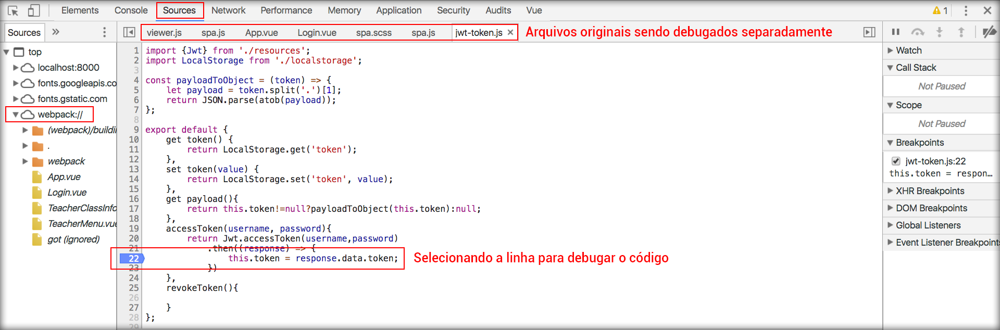

# Debug da aplicação e sourcemaps

Neste módulo falaremos de um recurso que é muito importante quando se trata de aplicações com Laravel e Vue.js.

Quando estamos desenvolvendo e encontramos um erro na aplicação, às vezes se faz necessário abrirmos o developer tools e debugar o código na sessão **sources**. Como estamos trabalhando com webpack, teremos apenas um arquivo compactando todo código da nossa aplicação.

O fato de ter este empacotamento faz com que os arquivos fiquem muito grandes para serem debugados, em alguns casos chegam até a travar o navegador.

Por este motivo mostraremos um recurso muito bom para conseguir debugar, mais facilmente, o código e encontrar as falhas da aplicação durante o desenvolvimento.

O recurso que apresentaremos tem o nome de **sourcemaps** e é configurado no arquivo **/webpack.mix.js**. 

Abra este arquivo e faça as seguintes alterações:

```js
mix.js('resources/assets/admin/js/admin.js', 'public/js')
   .sass('resources/assets/admin/sass/admin.scss', 'public/css')
   .sourceMaps();

mix.js('resources/assets/spa/js/spa.js', 'public/js')
   .sass('resources/assets/spa/sass/spa.scss', 'public/css')
   .sourceMaps();
```

Após fazer as alterações, pare o comando **watch** no terminal e rode-o novamente.

```sh
npm run watch
```

Em seguida, recarregue a aplicação no browser, analise o developer tools na sessão sources e verá que existe uma nova sessão criada para debug: **webpack://**.



Existe outra funcionalidade muito importante, durante o desenvolvimento, e que nos torna mais produtivos que é o **browserSync**. Este recurso trabalha com o livereload, que consiste em assistir determinados arquivos e quando os mesmos são alterados o servidor faz o reload da página automaticamente, sem precisarmos recarregar manualmente a cada alteração.

O browserSync trabalha por padrão na porta 3000. Precisamos informar a porta em que a nossa aplicação está rodando, para que possa haver a comunicação entre os servidores.

Antes de realizarmos a configuração, devemos instalar duas bibliotecas para conseguirmos executar este recurso. 

Rode o comando abaixo:

```sh
npm install browser-sync browser-sync-webpack-plugin --save-dev
```

Após a instalação, devemos configurar o browserSync como proxy do nosso servidor principal, que está rodando na porta 8000. Para isso, precisamos informar o link de acesso. Veja o código abaixo que foi adicionado no arquivo **webpack.mix.js**.

```js
mix.js('resources/assets/admin/js/admin.js', 'public/js')
   .sass('resources/assets/admin/sass/admin.scss', 'public/css')
   .sourceMaps();

mix.js('resources/assets/spa/js/spa.js', 'public/js')
   .sass('resources/assets/spa/sass/spa.scss', 'public/css')
   .sourceMaps();

mix.browserSync('localhost:8000');
```

Depois que adicionar a configuração, rode o comando **npm run watch** novamente, para que o recurso seja ativado. Você perceberá que o browserSync abrirá o navegador automaticamente, porém na porta 3000. 
Na url **http://localhost:3000/**.

Todo acesso será feito na porta 8000, visualmente você estará acessando a porta 3000. Por este motivo falamos que o browserSync trabalha como um servidor proxy.

Explicando em uma linguagem mais simples, o browserSync injeta um script em nossa aplicação para que ele consiga enviar um sinal para recarregar a aplicação, sempre que alguma alteração ocorrer.

Para testar, você pode acessar a url **http://localhost:3000/app#/login**.

Caso queira efetuar um teste, basta abrir o arquivo **/resources/assets/spa/js/spa.js** e adicionar o código abaixo. Depois de adicionar, basta salvar o arquivo e acessar o navegador. Você verá o reload automático, sem precisar fazer nada.

```js
alert('browserSync');
```

A partir de agora, qualquer arquivo que você alterar sua aplicação será recarregada. Tome cuidado com este detalhe, você pode ver que este é um recurso muito valioso que temos para desenvolver.

Antigamente, a configuração do browserSync era um pouco mais complexa. O objeto **mix**, do arquivo **webpack.mix.js**, nos traz tudo pronto de forma muito simples, tanto o empacotamento de javascript, css, sourceMaps e browserSync quanto outros recursos, que você poderá se aprofundar.