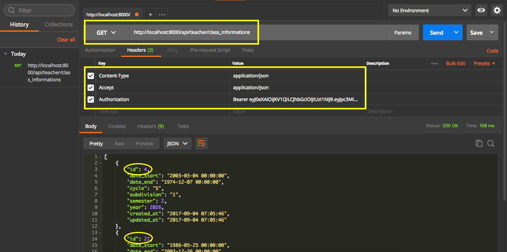

# Listando turmas do professor

Com a estrutura base do frontend montada, voltaremos para a API para começar a listar as turmas do professor.

Criaremos mais um recurso na API, para começar a consumir estas informações.

Abra o arquivo **/routes/api.php**.

```php
Route::group(['middleware' => 'auth.renew'], function () {
    Route::get('/user', function (Request $request) {
        return \Auth::user();
    });
    Route::group(['prefix' => 'teacher', 'as' => 'teacher.', 'namespace' => 'Teacher\\'], function(){
        Route::resource('class_informations', 'ClassInformationsController', ['only' => ['index', 'show']]);
    });
});
```

Criamos um grupo de rotas que terá como prefixo a string **teacher**, um alias **teacher.** e um namespace **Teacher**. Passamos o controller **ClassInformationsController** informando que terão apenas os métodos index e show.

Depois de adicionar o novo grupo de rotas, temos que criar novo controller que será responsável por gerenciar as ações. 

Abra o terminal e rode o comando abaixo:

```sh
php artisan make:controller Api/Teacher/ClassInformationsController --resource
```

Após criar, abra o controller **/app/Http/Controllers/Api/Teacher/ClassInformationsController.php**. 

Apague todos os métodos padrões, deixando somente index e show, assim como configuramos no arquivo de rotas.

```php
namespace SON\Http\Controllers\Api\Teacher;

use Illuminate\Http\Request;
use SON\Http\Controllers\Controller;
use SON\Models\ClassInformation;

class ClassInformationsController extends Controller
{
    /**
     * Display a listing of the resource.
     *
     * @return \Illuminate\Http\Response
     */
    public function index()
    {
        $results = ClassInformation::whereHas('teachings', function ($query){
            $id = \Auth::user()->userable->id;
            $query->where('teacher_id', $id);
        })->get();

        return $results;
    }

    /**
     * Display the specified resource.
     *
     * @param  int  $id
     * @return \Illuminate\Http\Response
     */
    public function show($id)
    {
        $result = ClassInformation::whereHas('teachings', function ($query){
            $id = \Auth::user()->userable->id;
            $query->where('teacher_id', $id);
        })->findOrFail($id);

        return $result;
    }
}
```

Veja que o método index armazena os resultados na variável **$results**. O método **whereHas** prepara uma query retornando-a na variável **$query** como parâmetro da function. Através desta query podemos montar o filtro que consiste em buscar todas as turmas relacionadas ao id do professor.

O id do professor foi resgatado através da façade **Auth** e não estamos passando o guard API porque a rota está protegida pelo middleware **auth.renew**.

Depois, o método get se encarrega de montar a coleção para retornar os resultados serializados.

O método show é muito parecido com o método index. O grande responsável por retornar o resultado apenas de uma turma é o método findOrFail.

Após criar a rota, o controller e os métodos, você pode fazer uma pesquisa através do **Postman**. 

Veja a imagem abaixo.



Não esqueça de passar o token para a requisição. Desta forma você terá todas as turmas relacionadas ao professor autenticado.

Você pôde ver na imagem acima que se trata de uma rota do tipo **get** para o endpoint **http://localhost:8000/api/teacher/class_informations**. O resultado foi todo serializado pelo Laravel.

Veja o resultado:

```json
[
    {
        "id": 4,
        "date_start": "2003-03-04 00:00:00",
        "date_end": "1974-12-07 00:00:00",
        "cycle": "5",
        "subdivision": "1",
        "semester": 2,
        "year": 2026,
        "created_at": "2017-09-04 07:05:46",
        "updated_at": "2017-09-04 07:05:46"
    },
    {
        "id": 27,
        "date_start": "1986-05-25 00:00:00",
        "date_end": "2003-12-26 00:00:00",
        "cycle": "4",
        "subdivision": "11",
        "semester": 1,
        "year": 2021,
        "created_at": "2017-09-04 07:05:46",
        "updated_at": "2017-09-04 07:05:46"
    }
]
```

O resultado do seu projeto não será o mesmo, pois os dados são gerados aleatoriamente. Gostaríamos de mostrar que é possível acessar a turma diretamente, passando o id ao final da rota.

* **http://localhost:8000/api/teacher/class_informations/4** 
* **http://localhost:8000/api/teacher/class_informations/27**

Caso tentemos acessar o id de uma turma não relacionada, teremos uma página de erro retornada pela API. Podemos alterar o tipo do erro, para que seja retornado um JSON.

Abra o arquivo **/app/Exceptions/Handler.php**.

```php
public function render($request, Exception $exception)
{
    if($exception instanceof ModelNotFoundException){
        if ($request->expectsJson()) {
            return response()->json(['error' => 'Model not found.'], 404);
        }
    }

    return parent::render($request, $exception);
}
```

Verificamos se a exception é uma instância de ModelNotFoundException e se a request espera um json. Caso as duas condições sejam atendidas, retornamos um erro no formato json e com status code 404.

A nossa regra de negócio impossibilita um professor acessar uma turma que não seja dele e isso é muito importante para nosso Sistema Educacional.

Fique atento ao tempo de expiração do token, que é configurado no arquivo **/config/jwt.php** na constante **JWT_TTL**. Para resolver este problema durante nossos testes, configuraremos um valor absurdo para a constante no arquivo **.env**. Desta forma, sobrescrevemos o valor padrão do arquivo de configuração *jwt.php*.

Abra o arquivo **/.env**.

```
JWT_TTL=6000
```

Não esqueça de parar o servidor e subir novamente, para que esta alteração tenha efeito.

Após estas alterações, faça os testes de listagem de turmas, acesso direto a uma turma específica e teste o acesso a uma turma que não está relacionada ao professor, para ver o erro em JSON.