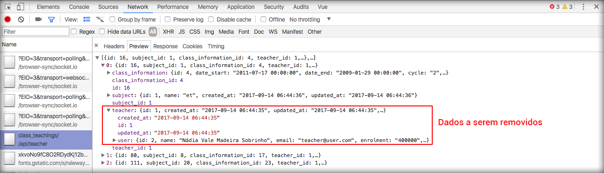

# Testando listagem de ensinos

No módulo anterior fizemos bastante alteração para que pudessemos trabalhar com as avaliações através do ensino, por ser muito mais fácil o relacionamento.

Criaremos um controller na API com recurso para fazer a listagem de disciplinas, relacionadas ao professor, e outro para pegar as informações de apenas uma disciplina.

Crie o arquivo **/app/Http/Controllers/Api/Teacher/ClassTeachingsController.php**, que será uma cópia do controller **ClassInformationsController.php**. Faça as seguintes alterações.

```php
namespace SON\Http\Controllers\Api\Teacher;

use Illuminate\Http\Request;
use SON\Http\Controllers\Controller;
use SON\Models\ClassTeaching;

class ClassTeachingsController extends Controller
{
    /**
     * Display a listing of the resource.
     *
     * @return \Illuminate\Http\Response
     */
    public function index()
    {
        $results = ClassTeaching::
            where('teacher_id',\Auth::user()->userable->id)
            ->get();

        return $results;
    }

    /**
     * Display the specified resource.
     *
     * @param  int  $id
     * @return \Illuminate\Http\Response
     */
    public function show($id)
    {
        $result = ClassTeaching::
            where('teacher_id',\Auth::user()->userable->id)
            ->findOrFail($id);

        return $result;
    }
}
```

Percebam que por estarmos trabalhando com o model **ClassTeaching** e não precisaremos mais utilizar o método **whereHas**, que estávamos utilizando para o controller anterior.

O próximo passo será configurar a rota no arquivo **/routes/api.php**.

```php
Route::group([
    'as' => 'api.',
    'namespace' => 'Api\\'
], function () {
    Route::post('/access_token', 'AuthController@accessToken');

    Route::group(['middleware' => 'auth.renew'], function () {
        Route::get('/user', function (Request $request) {
            return \Auth::user();
        });
        Route::group([
            'prefix' => 'teacher',
            'as' => 'teacher.',
            'namespace' => 'Teacher\\',
            'middleware' => 'can:teacher'
        ], function(){
           Route::resource('class_informations', 'ClassInformationsController', ['only' => ['index', 'show']]);
           Route::resource('class_teachings', 'ClassTeachingsController', ['only' => ['index', 'show']]);
        });
    });

    Route::group(['middleware' => 'auth:api'], function () {
        Route::post('/logout', 'AuthController@logout');
    });
});
```

Adicionamos o código do arquivo inteiro para saber onde foi adicionada a roda, mas atente-se somente ao código abaixo:

```php
Route::resource('class_teachings', 'ClassTeachingsController', ['only' => ['index', 'show']]);
```

Agora você precisa criar o novo componente para testar a listagem. Crie o arquivo **/resources/assets/spa/js/components/teacher/TeacherClassTeachingList.vue**.

```html
<template>
    <div class="container">
        <div class="row">
            <h3>Minhas turmas</h3>
            <table class="table table-striped">
                <thead>
                <tr>
                    <th>Data Início</th>
                    <th>Data Fim</th>
                    <th>Turma</th>
                    <th>Disciplina</th>
                    <th>Ações</th>
                </tr>
                </thead>
                <tbody>
                <tr v-for="classTeaching in classTeachings">
                    <td>{{classTeaching.class_information.date_start | dateBr}}</td>
                    <td>{{classTeaching.class_information.date_end | dateBr}}</td>
                    <td>{{classTeaching.class_information | classInformationAlias}}</td>
                    <td>{{classTeaching.subject.name}}</td>
                    <td>
                        <router-link :to="{name: 'teacher.class_tests.list', params: {class_teaching: classTeaching.id} }">
                            Avaliações
                        </router-link>
                    </td>
                </tr>
                </tbody>
            </table>
        </div>
    </div>
</template>

<script type="text/javascript">
    import store from '../../store/store';

    export default {
        computed: {
            classTeachings() {
                return store.state.teacher.classTeaching.classTeachings;
            }
        },
        mounted() {
            store.dispatch('teacher/classTeaching/query');
        }
    }
</script>
```

Vejam que o componente também é muito parecido com o componente de listagem de turmas, mas alteramos um pouco a estrutura de layout.

A parte de scripts, do componente, é praticamente a mesma, pois alteramos apenas os dados do armazem.

Na diretiva **v-for** estamos acessando o resultado do armazem **classTeaching** e logo depois acessando os dados de **class_information**, onde estão os dados que nos interessa.

Estamos tendo o resultado que esperávamos, mas se você analisar a resposta da requisição, no developer tools, verá que existem dados desnecessários.



Precisamos remover estes dados, que não utilizaremos, para ter uma resposta mais limpa. Para remover estes dados será necessário transformar a resposta da API em array e depois excluir os dados do professor.

Volte ao arquivo **/app/Http/Controllers/Api/Teacher/ClassTeachingsController.php** e faça as seguintes alterações.

```php
    public function index()
    {
        $results = ClassTeaching::
            where('teacher_id',\Auth::user()->userable->id)
            ->get()
            ->toArray();

        return array_map(function($item){
            unset($item['teacher']);
            return $item;
        }, $results);
    }

    public function show($id)
    {
        $result = ClassTeaching::
            where('teacher_id',\Auth::user()->userable->id)
            ->findOrFail($id)
            ->toArray();
        
        unset($result['teacher']);
        return $result;
    }
```

Utilizamos o método **toArray** para transformar a resposta em array e, antes de retornar, estamos removendo os dados desnecessários, que neste caso são os dados do professor. Lembrando que quanto menos dados for passado na resposta mais rápida será a aplicação.

Agora precisamos criar o filtro **classInformationAlias**, que estamos utilizando para a listagem das turmas, mas não o criamos ainda. Por este motivo existe um erro no console.

```html
<td>{{classTeaching.class_information | classInformationAlias}}</td>
```

Abra o arquivo **/resources/assets/spa/js/filters.js** e adicione o filtro abaixo.

```js
Vue.filter('classInformationAlias', function(classInformation){
    return `${classInformation.cycle}.${classInformation.subdivision}.${classInformation.semester}.${classInformation.year}`;
})
```

Desta forma pode voltar ao frontend e ver os dados da turma sendo listados corretamente.

Ainda existe um erro no console porque já adicionarmos uma rota para as avaliações, mas ainda não configuramos esta parte, por este motivo temos o erro. Veja o código com a rota de avaliação.

```html
<td>
    <router-link :to="{name: 'teacher.class_tests.list', params: {class_teaching: classTeaching.id} }">
        Avaliações
    </router-link>
</td>
```

Percabam que a rota levará o professor a listagem de avaliações para determinada disciplina, porém esta estrutura será desenvolvida no próximo módulo.

O mais importante é perceber que com o vuex configurado, com o vue funcionando e com o uso de componentes tudo começa a ficar mais fácil de ser criado.