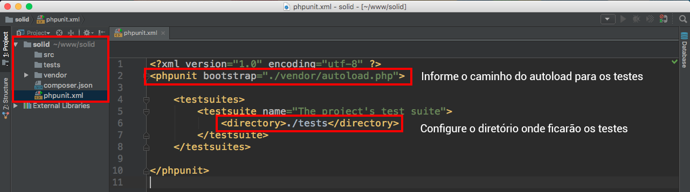

# Introdução

Nesse curso, você aprenderá, na prática, as boas práticas de programação em orientação a objetos conhecidas por SOLID. Durante o curso, você entenderá os principais conceitos, bem como verá o desenvolvimento de uma simples biblioteca totalmente SOLID.

Este conteúdo não é para quem está iniciando com PHP, ele exige que já conheça a linguagem e também que já saiba trabalhar com Composer. O conteúdo inteiro iremos exemplificar, porém não iremos focar no passo a passo de ferramentas externas.

Utilizaremos, em boa parte do conteúdo, o PHPUnit. Iremos falar um pouco sobre o PHPUnit durante o desenvolvimento. Se você já souber TDD será ótimo, mas se não conhece fique tranquilo que não terá problemas para acompanhar.

É recomendade que esteja com a versão 7.0 do PHP. Versões anteriores à 7.0 não permitirá que consiga acompanhar o conteúdo que será fornecido a vocês.

Não precisa ter um sistema operacional específico, mas se estiver utilizando Windows é muito importante que tenha o Git Bash instalado. Em qualquer sistema que for utilizar é muito importante, também, que estejam com a variável de ambiente configurada corretamente para o PHP, de modo que ao digitar `$ php -v` você tenha o resultado da versão no terminal.

Então daqui pra frente iremos começar com o conteúdo sem se preocupar com coisas básicas de PHP, é fundamental que quem esteja lendo este conteúdo saiba ao menos o que é uma classe e saiba criar uma de fato.

A abordagem do conteúdo será bem mais prática do que teórica, embora em alguns pontos não seja possível escapar da teoria, mas tentaremos ao máximo exemplificar os assuntos. O foco é fazer com que o conteúdo seja passado de uma forma tranquila sem que seja massante ao leitor.

# Criando aplicação com composer

Crie a pasta raiz do seu projeto e dentro comece com o comando `$ composer init` para iniciarmos a Library. Você deverá ir preenchendo os passsos que o composer sugerir, na parte de dependências pesquise por `phpunit/phpunit` e prossiga com a criação do arquivo package.json. O type será **library**.

Ao final da instalação deverá ter uma arquivo chamado package.json com o conteúdo abaixo. Caso tenha pulado algum passo, na criação, você pode alterar manualmente.

```json
{
    "name": "son/solid",
    "description": "Conteúdo de Solid com PHP",
    "type": "library",
    "require": {
        "phpunit/phpunit": "^5.7"
    },
    "authors": [
        {
            "name": "Thiago Valls",
            "email": "atendimento@schoolofnet.com.br"
        }
    ],
    "require": {},
    "autoload": {
        "psr-4": {
            "Solid\\Html\\": "src"
        }
    }
}
```

Repare que o **autoload** não fazia parte do arquivo inicial, nós adicionar posteriormente, porque iremos trabalhar com o autoload **psr-4** e o namespace será **Solid\\Html\\** e apontará para a pasta **src**.

Como em nossa pasta raiz ainda não existe esta pasta crie agora mesmo, para que possamos continuar.

O próximo passo é acessar a pasta raiz, em seu terminal, e rodar o comando `$ composer install`. Ele irá instalar as dependências do projeto e criar uma pasta chamada **vendor**, onde conterá todos os arquivos referentes às dependências do projeto.

Crie também um diretório chamado **tests** onde abrigará todos os testes que criaremos com o decorrer do conteúdo.

O último passo será criar um arquivo chamado **phpunit.xml** onde iremos configurar o phpunit.

## Conteúdo de configuração do PHPUnit

```xml
<?xml version="1.0" encoding="utf-8" ?>
<phpunit bootstrap="./vendor/autoload.php">

    <testsuites>
        <testsuite name="The project's test suite">
            <directory>./tests</directory>
        </testsuite>
    </testsuites>

</phpunit>
```

Este é um arquivo simples de configuração e bem padrão, que pode ser utilizados para vários projetos. Caso seja necessário a evolução desta configuração iremos fazer manualmente com o decorrer dos conteúdos. Você não irá encontrar o Coverage (Cobertura de Testes) neste arquivo, porque costumamos utilizar um arquivo separado para este fim, melhorando assim o processamento enquanto vamos trabalhando em cima da Library que será criada.



Veja na imagem acima que primeiro apontamos, aos testes, onde está o autoload e também configuramos o diretório onde estarão todos os testes. Na imagem marcamos também qua deverá ser os seus arquivos iniciais para continuarmos com a criação do primeiro teste.