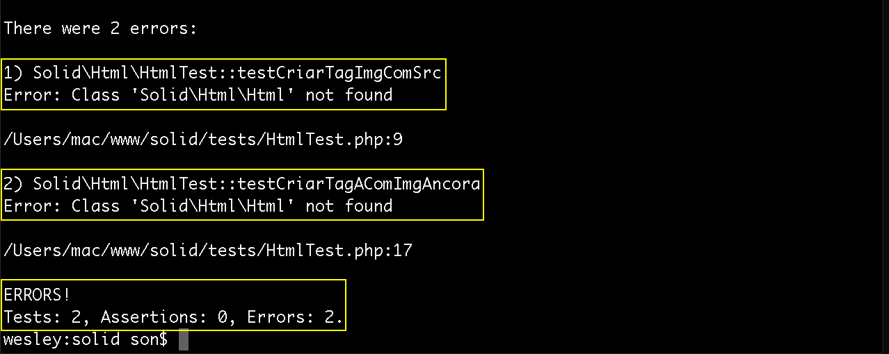

# Criando a biblioteca sem solid

Agora que temos a estrutura criada, iremos criar o primeiro arquivo, no diretório tests.

O arquivo será uma classe padrão do PHP e se chamará **HtmlTest.php**. O arquivo deverá somente ter a tag php abrindo, esta tag não será fechada seguindo os padrões de desenvolvimento.

Como é uma classe, deverá ter o mesmo nome do arquivo e deverá ter o namespace que foi configurado no arquivo package.json. Veja o código abaixo:

```php

namespace Solid\Html;

class HtmlTest extends \PHPUnit_Framework_TestCase
{
    public function testCriarTagImgComSrc()
    {
        $html = new Html;
        $img = $html->img('img/photo.png');

        $this->assertEquals('', $img);
    }

    public function testCriarTagAComImgAncora()
    {
        $html = new Html;
        $img = $html->img('img/photo.png');

        $a = $html->a('http://www.example.com.br', $img);

        $this->assertEquals('<a href="http://www.example.com.br"></a>', $a);
    }
}

```

Primeiro é interessante falar que toda classe de teste deve extender **\PHPUnit_Framework_TestCase** para que os teste realmente funcionem.

Depois temos que analisar os métodos criados para teste. Primeiro criamos o método **testCriarTagImgComSrc** e depois **testCriarTagAComImgAncora**.

O primeiro é responsável por retornar uma tag img, do html, com um parâmetro que deverá ser passado com o endereço da imagem, o src.

A segundo será responsável por gerar uma âncora com uma imagem dentro, diferente do método anterior este recebe dois parâmetros, o link e a imagem.

O método **assertEquals** está recebendo dois parâmetros:  o primeiro deve ser o você espera como resposta e o segundo a variável que será comparada no teste.

Feito isso, basta rodar o teste no terminal com o comando `$ vendor/bin/phpunit`.

O resultado que esperamos é negativo, deverá aparecer o seguinte erro:



Este erro se dá porque ainda não criamos as classes que instanciamos nos testes. Como elas não existem o teste realmente deve falhar. Agora iremos criar estas classes e os métodos que utilizamos para que o teste deva passar com acertos. Veja o código da classe abaixo:

```php
namespace Solid\Html;

class Html
{
    public function img(string $src)
    {
        return '';
    }

    public function a(string $href , string $anchor)
    {
        return '<a href="' . $href . '">' . $anchor . '</a>';
    }
}
```

Não existe nenhum segredo mirabolante nos métodos implementados pela classe Html. São métodos simples que retornam as tags que solicitamos. E se o retorno for igual ao esperado pelo teste, ele irá passar corretamente, caso tenha qualquer erro ele irá acusar.


Reparem que os dois teste passaram corretamente, isso quer dizer que o retorno das classes são exatamente o que os testes esperam. Isso resulta em dois acertos, que você pode observar na imagem acima.

E agora temos uma classe que nos permite criar uma tag img e outra que permite criar uma tag âncora com uma imagem dentro. No próximo conteúdo iremos evoluir, um pouco mais, a classe e ir complicando um pouco mais, até que seja necessária a utilização dos conceitos SOLID.