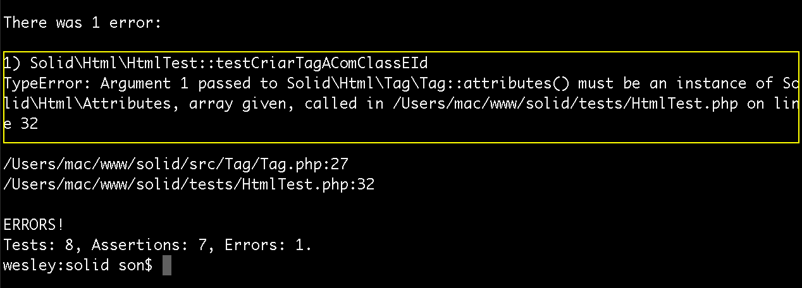

# Refatorando a classe html

Agora vamos refatorar a primeira classe que criamos, fazer com que ela fique mais dinâmica e que todos os testes passem sem erros.

Começamos o código para explicação:

```php
namespace Solid\Html;

class Html
{
    public function __call(string $name, $arguments)
    {
        return $this->createTags($name, $arguments);
    }

    public function createTags(string $name , $arguments)
    {
        $class = 'Solid\Html\Tag\\' . ucfirst($name);

        $reflection = new \ReflectionClass($class);
        return $reflection->newInstanceArgs($arguments);
    }
}
```

Apagamos todos os métodos que havíamos criado anteriormente e fizermos de uma forma dinâmica. Isso quer dizer que agora você pode, através desta classe, executar qualquer classe de Tag.

Basta passar o nome da Tag e os argumentos que precisar.

## Como isso é feito?

Reparem que atribuímos uma string com o caminho base das classes **Solid\Html\Tag\\**. Depois concatenamos com o nome passado por argumento, com uma função do PHP que transforma a primeira letra da palavra em maiúscula, isso porque todas as classes começam com letra maiúscula.

Depois utilizamos a classe ReflectionClass `new \ReflectionClass($class);` passando a classe como parâmetro e logo depois retornamos o método newInstanceArgs `newInstanceArgs($arguments);`. Este método retorna um objeto já instanciado e com os argumentos como parâmetros, desta forma ele irá fazer tudo pra gente.

E percebam que, para completar a mágica, utilizamos a função **__call()** para chamar o método e fazer tudo isso automaticamente.

Feita esta alteração na classe Html você pode rodar os testes novamente, descomentando o arquivo HtmlTest e voltando ao que era no início do conteúdo.

Você terá dois erros que vamos tratar abaixo:

# Primeiro erro


Vejam que o primeiro erro está falando que o atributo deve ser uma string. Vamos resolver este erro inserindo o código abaixo na classe Tag.php.

```php
    public function __construct()
    {
        $this->attrs = func_get_args();

        foreach ($this->attrs as &$value)
        {
            if(is_a($value , 'Solid\Html\Tag\TagsContract'))
            {
                $value = (string) $value;
            }
        }

        $this->validate();
    }
```

Alteramos o construtor para que ele faça um foreach, nos argumentos passados, antes de executar o método **validate**.

Neste foreach avaliamos se o `$value` é um objeto da classe **Solid\Html\Tag\TagsContract**, caso seja nós forçamos que ele seja uma string. Reparem que estamos utilizando uma referência na variável $value(**&**$value), desta forma alteramos diretamente no array `$this->attrs`.

# Segundo erro



O segundo erro diz que estamos passando um array como parâmetro e que deveria ser um objeto instanciado da classe Attributes. Iremos resolver da seguinte maneira, também na classe Tag.php:

```php
    public function attributes($attributes)
    {
        if(is_array($attributes))
        {
            $attributes = new Attributes($attributes);
        }

        if(!is_a($attributes, 'Solid\Html\Attributes'))
        {
            throw new \Exception('$attributes must be Solid\Html\Attributes instance');
        }

        $this->optional_attrs = $attributes;
    }
```

Antes estávamos forçando que o parâmetro passado para o método fosse um objeto. Nós alteramos isso, agora o parâmetro passado pode ser um array.

Testamos se o parâmetro é um array, caso seja, nós atribuímos à variável $attributes uma instância passando o mesmo parâmetro anterior, desta forma estamos resolvendo esta questão e já passando a instância do objeto: `$this->optional_attrs = $attributes;`.

Inserimos também um teste para saber se o a variável é uma instância da classe Attributes, caso não seja disparamos um erro, caso contrário segue o fluxo da programação normalmente.

# Expandindo a classe

Agora que resolvemos todos os erros podemos expandir a classe e inserir também a chamada como modo estático. Veja código abaixo da classe Html.php:

```php
namespace Solid\Html;

class Html
{
    public function __call(string $name, $arguments)
    {
        return $this->createTags($name, $arguments);
    }

    public static function __callStatic(string $name, $arguments)
    {
        return self::createTags($name, $arguments);
    }

    public static function createTags(string $name , $arguments)
    {
        $class = 'Solid\Html\Tag\\' . ucfirst($name);

        $reflection = new \ReflectionClass($class);
        return $reflection->newInstanceArgs($arguments);
    }
}
```

Reparem que, além da função **__call()** inserimos agora a função **__callStatic()** que retorna `self::createTags($name, $arguments);`. Mas para isso funcionar temos que alterar o método **createTags** para estático. `public static function createTags(string $name , $arguments)`.

# Criando teste para modo estático

No arquivo HtmlTest.php iremos inserir o seguinte teste:

```php
   public function testCriarTagAComClassEIdComModoEstatico()
    {
        $a = Html::a('http://www.example.com.br', 'Meu Site');
        $a->attributes([
            'class'=>'btn btn-default'
        ]);

        $this->assertEquals('<a href="http://www.example.com.br" class="btn btn-default">Meu Site</a>', $a);
    }
```

Vejam que não instanciamos a classe Html, nós já passamos a chamada de método estático direto. `Html::a('http://www.example.com.br', 'Meu Site');`.

# Conclusão

Pronto! Deste modo temos a classe melhorada e com todos os testes passando normalmente. A classe pode ser utilizada de forma estática ou não, você pode escolher a forma de usá-la. Percebam que com os testes, tudo vai ficando mais organizado e trabalhando com SOLID você pode ir melhorando seu código, também de forma organizada.

No próximo conteúdo, iremos ainda analisar alguns itens desta classe, mesmo ela funcionando corretamente não quer dizer que esteja tudo correto. Iremos falar sobre utilizar **new** dentro de uma classe ou método e também sobre interface segregation.