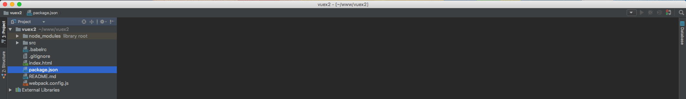
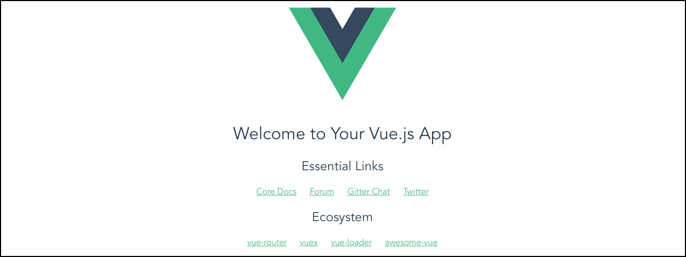

# Criando aplicação Vue.js

Para trabalhar com o conteúdo proposto faremos alguma refatorações, em cima da aplicação do Campeonato Brasileiro, visto no conteúdo sobre Vue.js 2.

Gostaríamos de deixar o link para a documentação do Vuex 2, para que possam consultar durante o estudo. Poderá também ler sobre as versões anteriores e tudo que quiser pesquisar sobre a biblioteca. Encontrará tudo no link abaixo:

<http://vuex.vuejs.org/en/>

Gostamos sempre de falar, em nossos conteúdos, que é muito importante, sempre que tiver qualquer dúvida, buscar primeiro a documentação da ferramenta. Antes de qualquer fórum ou blog que possam consultar, porque é o local oficial e mais seguro que pode buscar qualquer informação.

***

É muito importante que tenha conhecimento de **webpack** para que possa aproveitar, ao máximo, o conteúdo deste assunto. Caso não tenha conhecimento, procure ler antes de prosseguir. A School Of Net tem conteúdo do sobre webpack também.

Será preciso que tenha instalado, em sua máquina, o Node.js.

Caso não tenha acesse o link <https://nodejs.org/en/> e faça o download e instalação da ferramenta. Você tem que ter a ferramenta configurada em seu sistema operacional. Se já leu o conteúdo de Vue.js 2, com certeza já fez a instalação e já tem em sua máquina local. No momento da criação deste conteúdo temos a versão 6.9.2 como sendo LTS, mas temos a versão 7.3.0 que é atual. Você pode escolher com qual trabalhar, nós idicamos utilizar a versão LTS, sempre, porque terá suporte garantido durante um bom tempo, até que a versão atual torne-se a LTS (Long Term Support).

No Windows e no Mac você instala com apenas alguns cliques e no Linux você consegue encontrar o tutorial, no próprio site, onde irá conseguir instalar via `apt-get ou yum`, dependendo a distribuição que utilizar.

Além do Node, precisaremos ter instalado a ferramenta de linha de comando do Vue. Quem vem do conteúdo de Vue 2 já terá também instalado. Para saber se tem ou não a ferramenta, basta digitar `$ vue` no terminal. Terá o retorno de dois comandos: init e list

Comando | Função
------------- | ----------
init | serve para iniciarmos uma aplicação com Vue
lista | listar os tipos de templates que podemos criar a apalicação. Atualmente existem 5 tipos.

Liste em seu terminal para saber todas as opção, mas informamos que utilizaremos o template webpack-simple. Desta forma já trabalharemos com o webpack e teremos que fazer algumas configuração para que tenhamos ele funcionando corretamente. No conteúdo de Vue 2, nós fizemos a configuração e falamos sobre.

Com webpack nós conseguimos criar módulos, fazer requires, trabalhar com módulos da ES6. Você poderia trabalhar com a forma antiga, utilizando somente javascript puro, mas queremos orientar vocês a sempre trabalhar com a ES6. A ES6 já está disponível a um bom tempo, nós temos conteúdos na School Of Net, para que possa aprender a utilizar e estar por dentro do que há de mais novo no mundo do desenvolvimento.

# Iniciando aplicação

Abra seu terminal, acesse o local onde queira criar sua aplicação e rode o comando `$ vue init webpack-simple vuex2`.

A instalação pedirá algumas informações, para que seja criado o arquivo **package.json**. Você pode informar ou clicar em "enter" para ir prosseguindo.

Segue a estrutura da aplicação após a instalação:

Diretório/Arquivo | Função
---------------------- | -----------
**node_modules** | Pasta criada à partir do comando `npm install` que armazena todos os arquivos pertencentes às dependências instaladas em seu projeto
**src** | Pasta responsável por armazenas os arquivos do projeto
**.babelrc** | Arquivo de configuração necessário para informar para qual versão de nossa ECMAScript será compilado o código. Neste caso da ES6 para ES5. Lembrando que isso é necessário porque nem todos os browsers são compatíveis com a ES6
**.gitignore** | Arquivo que ignora os itens para o controle de versão
**index.html** | Arquivo inicial do projeto
**package.json** | Arquivo com todas informações e dependências do projeto
**README.md** | Arquivo de instruções sobre a aplicação
**webpack.config.js** | Arquivo de configuração do **webpack**, que nos permite empacotar toda aplicação javascript

***

Já falamos que o package.json é responsável por toda configuração das dependências do projeto. Mas precisamos falar também, que existem dois scripts: dev e build.

Script | Função
-------- | -----------
dev | podemos rodar a aplicação em modo de desenvolvimento com a funcionalidade inline hot, rodando apenas o comando `$ npm run dev`
build | gera a aplicação em modo de produção para que possamos subir para o servidor. Comando `$ npm run build`

Você pode pesquisar, um pouco mais, sobre cada dependência da instalação do projeto, analisando este arquivo, mas não é o foco no momento. Falaremos a medida que for sendo necessário.

# Subindo aplicação

Para conferirmos se a aplicação está rodando corretamente, iremos rodar, no terminal, `$ npm run dev`. Veja a imagem abaixo:

Se em seu browser, tiver o resultado acima é porque está tudo correto e estamos prontos para dar início ao conteúdo.