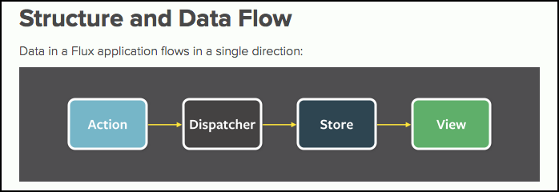

# Flux e Redux

Vamos falar sobre as duas ferramentas que serviram de inspiração para a criação do Vuex: **Flux e Redux**.

# Flux

Uma ferramenta criada pelo Facebook. Nada mais e do que uma implementação da fonte única da verdade, então o pessoal do Facebook criou uma implementação para a gente construir uma aplicação no browser, do lado cliente, administrando o **estado**.

Para entendermos a diferença do Flux para outros tipos de paradigmas podemos citar um caso.

A 6 anos atrás, quando o Angular Js e o Knockout foram criados, nasciam os frameworks pioneiros no recurso do databinding, que nos possibilita administrar o fluxo de informação da aplicação. Com Angular mudamos completamente o paradigma de desenvolvimento web, pois, quando trabalhamos com ele, temos uma arquitetura bem próxima do MVC e antes nós não tínhamos isso, porque, até então, as aplicações web eram criadas através da manipulação do DOM.

Com o Angular nós criávamos os modelos, o modelo comunicava com o controle e o controler comunicava com a view e todos se comunicavam. Então não tínhamos um controle muito grande destas informações, porque qualquer um destes elementos poderia alterar o estado da aplicação, isso é muito prático, muito fácil de usar, mas dependendo do modo que você cria sua aplicação você acaba perdendo o controle deste fluxo, e também pode dificultar a maneira com que as informações serão compartilhadas nas partes da sua aplicação. Porque não temos uma fonte única da verdade, então qual o local que vou centralizar minhas informações? Também qualquer um pode alterar qualquer dado em qualquer lugar.

Estas foram questões muito discutidas, logo que estes frameworks foram lançados.

Falando de Flux, como que funciona a questão da fonte única da verdade? Como podemos gerenciar o estado da aplicação?

Abrindo a documentação do Flux podemos concluir que ele trabalha com o sentido **unidirecional** para podermos fazer as alterações das informações do estado. Não existe mais o conceito de controller, view ou model alterando tudo ao mesmo tempo. Teremos que passar por algumas etapas para que esta informação seja alterada.

Teremos que determinar uma ação, que poderá ser adicionar, editar ou excluir um dado. Depois a ação irá chamar o **dispatcher** que é o responsável por disparar o evento que irá alterar o **Store**, que seria o armazem. O estado da aplicação fica então no Store para que seja consultado pela view.

Desta forma, quando o dispatcher alterar algo no estado/Store, como a view vai estar ligada com o armazem, automaticamente esta alteração será propagada para os demais componentes que estiverem utilizando estas informações.

Então os passos são estes:

1. A view chama uma action
2. A action chama o dispatcher
3. O dispatcher executa o evento que irá alterar os dados no armazem
4. O armazem devolve os dados atualizados para a view

Estes passos sempre deverão ser seguidos para que o conceito seja executado corretamente. E o mais legal de tudo isso é que o armazem encontra-se protegido, mesmo com a view ligada ao armazem ela não consegue alterar nada diretamente, sempre terá que passar pela action e pelo dispatcher. Por isso falamos que o armazem é inalterável, ninguém, de fora, consegue alterar nada, somente o dispatcher.

Isso vai permitir que tenhamos os estados da aplicação guardados no Store e cada componente que criarmos terá o seu estado local armazenado, depois é responsabilidade do seu componente manter os estados locais atualizados. Quando for necessário o componente terá que acessar a action para que algum dados seja alterado.

Este é o conceito do Flux, não entraremos muito em detalhe porque não iremos utilizar, mas falamos sobre ele para que vocês pudessem saber de onde veio a inspiração para o Vuex. É importante saber que o Facebook utiliza muito o Flux juntamente com o React, um framework também desenvolvido pelo Facebook para aplicações front-end. Então se você utiliza o React pode ter certeza que estará utilizando o Flux.

# Redux

O Redux é uma implementação mais simples do Flux. Se você quer utilizar o conceito do Flux em uma aplicação você pode utilizar o Redux que ele é mais fácil de se integrar com outros frameworks, mas o princípio é o mesmo do Flux.

O Vuex se baseou nesta ideia que existe entre Flux e Redux quando foi criar o Vuex. Na verdade o autor criou o Vuex para ser o Flux e Redux do Vue.js. Esta é a definição para o Vuex.

Se quiser saber meais sobre Flux e Redux você pode acessar as duas páginas oficiais para dar uma olhada na documentação. Se os links abaixo para consulta:

<https://facebook.github.io/flux/docs/overview.html#content>

<http://redux.js.org/docs/introduction/ThreePrinciples.html>

Seria interessante saber um pouco mais sobre estas arquiteturas.

# Conclusão

O mais legal de todas estas tecnologias aparecendo é que está se criando um novo paradigma de criação de aplicações web. Quem um dia iria imaginar lá no começo do ano 2000 que estaríamos do jeito que estamos hoje. Antigamente era tudo manualmente manipulando Dom e hoje estamos do jeito que estamos. A web realmente vem com tudo. Porque agora já pensamos em modularização, componentes, estados, fonte única da verdade e fluxo de informação. Isso muda totalmente a maneira de desenvolvermos uma aplicação web.

Acho importante que entendam estas mudanças de paradigmas que houveram, de alguns anos para cá, no desenvolvimento. Desde que surgiu o databinding, que virou uma febre, no Angula Js nós achamos que os problemas haviam acabado, mas conforme foram evoluindo as aplicações surgiram outros problemas, porque ao mesmo tempo que começamos a nos preocupar mais com os dados, começamos a nos perder com tanta informação.

Por este motivo veio esta tecnologia chamada Vuex para resolver este outro problema. E é por isso que é interessante que acompanhe a evolução da web, para que entenda o motivo pelo qual ela está se desenrolando para este caminho.