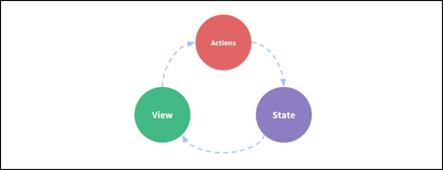

# Vuex

Passamos por todo este processo de aprendizagem e todas estas informações complementares para chegar até aqui. Vamos começar, finalmente, a falar do Vuex.

Ela é a implementação da fonte única da verdade, baseada no Flux e no Redux, para que possamos trabalhar com os componentes usando o Vue.js.

Tem a documentação que você pode ver. A documentação é muito pequena, bem menor que a do Redux e a implementação é muito simples. Ele é muito fácil de usar.

<https://vuex.vuejs.org/en/intro.html>

O que autor do Vuex fez é digno de muitas palmas. Todas as ferramentas desenvolvidas para o Vue.js é muito diferente de todas as outras. Por isso que cada dia que passa o Vue e mais utilizado e algumas empresas e desenvolvedores já vem aderindo o uso dele. Temos que olhar para este framework com carinho e não podemos ficar desatualizado.

Precisamos sempre manter a imagem acima nem nossa cabeça, porque é o fluxo que os dados irão seguir para trabalhar com o Vuex. Nós temos as views chamando as ações que irá refletir no estado que, por sua vez, irá refletir na view. Este fluxo ou ciclo é sempre constante.

Esta imagem acima resume toda implementação do Vuex. Por isso preste muita atenção daqui para baixo.

Imaginem que temos o componente, que está de cor verde, ai vamos dispachar alguma ação, que será a alteração do estado da aplicação. A ação pode ser assíncrona, por isso temos aquela ação externa chamada **backend API**. Depois da ação teremos uma mutação e a mutação que de fato irá alterar o estado. E por fim o estado irá refletir as atualizações na renderização das views.

Então é desta forma que está escrita acima que funciona o ciclo do Vuex. Você precisa entender este processo e, se precisar, acesse sempre esta imagem, porque ela resume muito bem o processo.

Inclusive, se analizar a imagem, você pode ver que durante a mutação existe um processo que pode agir externamente. Seria uma ferramenta de desenvolvimento do Vue.js. Nós conseguimos ver os componentes que temos e também conseguimos ter um acompanhamento e um histórico dos estados sendo alterados.

Nós podemos reduzir a imagem acima se não utilizar nenhum tipo de ação assíncrona ou ações normais. Podemos trabalhar diretamente com as mutações. Isso quer dizer que o componente pode executar uma mutação direta no estado.

O fato mais importante, que temos que entender, é que o estado, ou armazem, só será alterado por mutações no final das contas, independente se existirá uma action ou não. O estado nunca será acessado diretamente, pois este é o conceito da fonte única da verdade.

Então à partir de agora, aquela funcionalidade de two-way databinding cai por terra, porque mesmo que tenhamos o objeto, com o modelo de dados, pronto para ser alterado, nós não iremos conseguir alterar diretamente como tínhamos feito até o momento. Somente através das mutações.

Iremos trabalhar exatamente como manda a arquitetura do Vuex. E iremos utilizar o Vuex 2, que foi lançado logo após o lançamento do Vue 2.

# Diferença do Vuex 2 para o Vuex 1

Alguns equívocos foram removidos e temos uma ferramento muito menos acoplada ao Vue.js. Antes tínhamos que fazer algumas configurações restritas no componente, configurar getters e actions. Agora não precisamos mais. Estamos centralizando as configurações no próprio armazem, nós só temos que chegar no componente e utilizar, mais nada. Não precisamos mais ficar acoplando o componente ao Vuex. Será necessário apenas importar o armazem e fazer o que quisermos à partir daí.

Não temos uma mudança muito drástica de uma versão para outra. A migração será muito fáci,l para você que utilizava a versão anterior. Não há nada que vá quebrar totalmente a sua aplicação quando mudar para o Vuex 2.

Se prepare para começar a trabalhar com a nova ferramenta que vai revolucionar as suas aplicações. Terá todo controle, de todos os componentes.