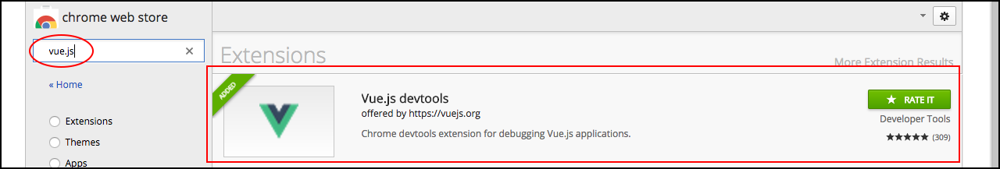
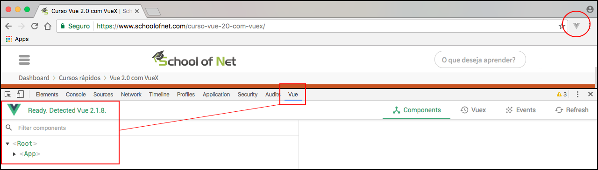
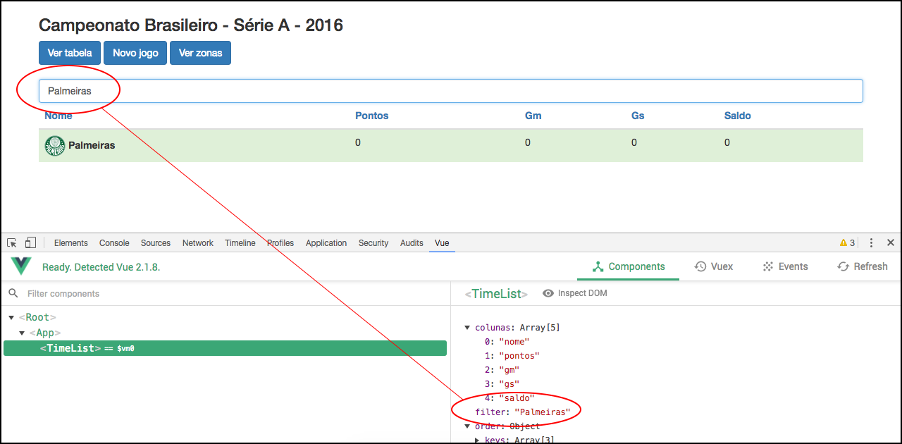

# Vue.js devtools

Acabamos o conteúdo, atingindo nosso objetivo. 
Queremos apresentar uma ferramenta fantástica para trabalhar, no desenvolvimento, junto com o Vue e Vuex. 
Com esta ferramenta, conseguimos fazer o debug de toda aplicação, enquanto o desenvolvimento é feito.

Vamos imaginar a aplicação que acabamos de desenvolver. Nós temos 4 componentes, incluindo o app.component, e estamos trabalhando com Vuex. 
Se quisermos acompanhar os estados sendo modificados(aplicando o método commit), teremos que utilizar muito o comando `console.log()` e isso não seria muito legal. 
Temos uma ferramenta chamada Vue.js  Devtools, que nos permite ver todos os componentes que temos na aplicação, no momento. Conseguimos ver todas as alterações, como se fosse uma lista de commits do git, como também, os dados dos estados no armazém.

É possível até, reverter um estado, com a ferramenta.

# Instalando a Devtools

Esta ferramenta se integra com o Google Chrome, então você precisa utilizar o Chrome para debugar. 
Vá até extensões ou em Web Store e pesquise por **vue.js**. Será, provavelmente, o primeiro item a ser encontrado.

Depois de instalado, podem verificar que no canto superior direito, do navegador, haverá o ícone do Vue e também no console, quando estiver com a aplicação rodando. 
Será acrescentado um novo campo, para que possa fazer o debug. 
Veja imagem abaixo:

Faremos um debug, em tempo real, para que possam verificar como é maravilhosa esta ferramenta.

No campo de filtro dos times, digitaremos "Palmeiras". 
Veja na imagem abaixo, em tempo real, teremos o valor do campo filtro, sendo debugado.

Se fôssemos percorrer todos os componentes, o conteúdo ficaria muito extenso e com muitas imagens. Por este motivo, precisamos que vocês se comprometam a mexer bastante, a percorrer todos os componentes, ver as estruturas e fazer testes. Assim, compreenderão como a ferramenta funciona e como ela se comporta.

A imagem, acima, mostra a aba de componentes, mas temos também a aba do Vuex e Events, onde podemos conferir os estados da aplicação e tudo que acontece com eles, além dos eventos disparados.

Vejam na imagem abaixo:

# Conclusão

Basta que façam muitos testes na aplicação que acabamos de criar. Que utilizem a ferramenta de debug que acabaram de instalar. 
Queríamos que vocês tivessem uma boa base para que possam começar a desenvolver e evoluir com Vue.js e, claro, sempre utilizando Vuex, que é uma ferramenta maravilhosa e um conceito fundamental para que possam construir pequenas e grandes aplicações.

Boa sorte e até um próximo conteúdo.