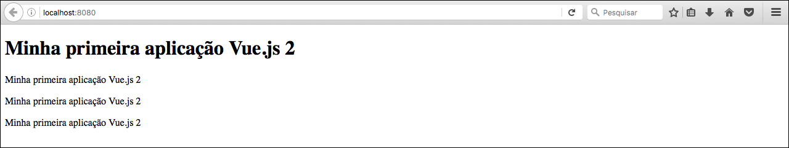

# Instância Vue e data binding

Os utilizadores de Vue costumam dizer que o mesmo é **reativo**.

#### O que significa ser reativo?

Significa tornar o HTML dinâmico. Sabemos que quando criamos uma página o nosso HTML fica estático, a não ser que tenhamos muito trabalho utilizando javascript para tornar alguma seção dinâmica e com alguma animação.

Para gerenciarmos o conteúdo de nossa página teremos que trabalhar em cima do **DOM** o tempo todo, não tem outra forma.

Esta era a proposta da web antiga. O problema desta proposta é justamente esta manipulação do DOM, porque gera uma programação chata, complexa e extensiva. Para adicionarmos alguma interação a nossa aplicação ou fazermos alguma atualização de dados, precisariamos de muitas linhas de código e seria uma programação repetitiva.

Esta **reatividade** ou **data binding**, que o Vue nos proporciona, é ideal para programarmos atualmente, porque ao invés de nos preocuparmos em atualizar o DOM nós vamos nos preocupar apenas com os dados da aplicação. O Vue que será responsável por fazer a atualização pra gente.

# Entendendo data binding na prática!

Vamos falar um pouco sobre nosso **index.html** antes de falarmos sobre o **data binding**.

Analisando nosso arquivo inicial podemos ver que o código é muito pequeno, porque estamos utilizando **webpack** que irá empacotar todo **javascript**, então basta que importemos o arquivo, empacotado, **build.js**.

```html
<!DOCTYPE html>
<html lang="en">
  <head>
    <meta charset="utf-8">
    <title>vue2</title>
  </head>
  <body>
    <div id="app"></div>
    <script src="/dist/build.js"></script>
  </body>
</html>
```

Este arquivo **build.js** será criado pelo webpack e será inserido em uma pasta chamada **dist**. Tudo isso é feito, automaticamente, pelo webpack.

Iremos precisar, também, de um **elemento**, em nosso HTML, para que possamos inicializar nossa aplicação com **Vue Js**. Segue nosso elemento:

```html
<div id="app"></div>
```

Agora iremos acessar a pasta **src** e dar início ao projeto e aprendizagem.

Comecemos por apagar o arquivo com extensão **.vue**, porque não utilizaremos por enquanto. Só iremos trabalhar com a pasta **assets**, onde podemos colocar imagens, arquivos fonte, arquivos de css e outros que quisermos. Por padrão já temos, dentro da pasta assets, o logo do Vue.js.

O arquivo que inicia nossa aplicação é o **main.js** e é este mesmo arquivo que o **webpack** toma como base para fazer o empacotamento. Se analisar este arquivo verá que o **vue-cli** já o cria utilizando a **ES6**.

```js
import Vue from 'vue'
import App from './App.vue'

new Vue({
  el: '#app',
  render: h => h(App)
})
```

Iremos apagar o segundo import e também o **render** do código acima, pois não iremos utilizar. Desta forma o código ficará assim:

```js
import Vue from 'vue'

new Vue({
  el: '#app',
})
```
Para que possamos dar início em nossa aplicação, basta que tenhamos a instância **Vue**, que é importada no código acima. Esta instância se encontra dentro da pasta **node_modules** que, por sua vez, foi criada à partir do comando `$ npm install`.

Então após importar a instância necessária, basta instanciarmos a mesma. Utilizamos o `$ new Vue({ })` e passamos o elemento HTML para que o Vue se localize e saiba onde inicia sua aplicação. Em nosso caso, utilizamos o elemento **#app** visto no código HTML já mostrado acima.

> ###Nós já temos uma aplicação Vue, mas como podemos saber se nossa aplicação está funcionando?

Com o webpack, nós já podemos executar nossa aplicação com **webserver** já embutido. Ele já possui o **webpack-dev-server** devidamente configurado pelo **vue-cli** na criação da aplicação.

Para confirmar esta configuração basta acessar o arquivo **package.json**, criado pelo vue-cli, e verá o **webpack-dev-server** como dependência de desenvolvimento. Verá também, em **scripts** que existem confirações de dois ambientes: **dev** e **build**

1. **dev:** Ambiente de desenvolvimento
2. **build:** Ambiente de produção. _Utilizamos quando vamos subir a aplicação para o servidor_

```
{
.
.
.
  "scripts": {
    "dev": "cross-env NODE_ENV=development webpack-dev-server --open --inline --hot",
    "build": "cross-env NODE_ENV=production webpack --progress --hide-modules"
  },
.
.
.
```

Por enquanto iremos utilizar somente o ambiente de desenvolvimento. Analisando o **script dev** podemos ver que ele vai gerar uma variável de ambiente **NODE_ENV=development** e também irá rodar o **webpack-dev-server** com algumas configurações como: **--open, --inline  e --hot**

Estas últimas configurações nos permite trabalhar com o que chamamos de **livereload**, que é um conceito atual para que não precisemos ficar atualizando nosso browser a todo momento. Esta configuração reconhece qualquer atualização em nosso código javascript e dispara uma atualização automática para o browser. Com isso ganhamos muito tempo de desenvolvimento.

# Rodando o ambiente de desenvolvimento

Para iniciarmos basta rodar um dos seguintes comandos:

Comando | Ambiente
-------------- | -------------
 `$ npm run dev` | Desenvolvimento
 `$ npm run build` | Produção

Após rodar o comando `$ npm run dev`, em nosso terminal, já podemos abrir nosso browser e acessar **http://localhost:8080/**.

Ainda não irá aparecer nada na tela, porque realmente ainda não temos nada em nosso arquivo index e nenhum script criado. Mas acessando o **developer tool** em **console** pode concluir que a aplicação está rodando corretamente. Não existirá nenhum erro no console e haverá algumas inicializações.

# Criando primeiro modelo de dados

Iremos começar por incluir um título qualquer em nossa aplicação. Em nosso **main.js** incluiremos o seguinte código:

```js
import Vue from 'vue'

new Vue({
  el: '#app',
  data: {
        título: "Minha primeira aplicação Vue.js 2"
    }
})
```

Agora que declaramos a propriedade **data**, padrão do Vue, e criamos o nosso modelo de dados, chamado título, queremos fazer com que ele apareça em nosso HTML. Desta forma estamos centralizando nossa aplicação no javascript e queremos fazer a comunicação com o HTML.

É exatamente o que o Vue irá fazer pra gente. Ligar nossa programação javascript com nosso HTML.

Agora podemos ir até nosso **index.html** e dentro do elemento **#app** podemos incluir o seguinte código:

```html
<div id="app">
  <h1>{{ título }}</h1>
</div>
```

Ao salvar o arquivo já poderá ver a atualização em seu browser. A interpolação irá fazer esta transposição do nosso javascript para o nosso HTML.

# Como é feita a transposição pelo Vue.js?

Quando criamos a instância **Vue** e passamos o nosso elemento **#app** de inicialização, o Vue.js compila e analiza **tudo** que tem dentro da **div app** para que ele consiga fazer esta interpolação e para gerenciar todas estas informações, o que chamamos de **data binding**, ou seja, é a ligação entre os dados do javascript e o HTML.

À partir desta interpolação, podemos fazer o que quisermos com nosso **{{ título }}**. Podemos utilizar onde quisermos e quantas vezes quisermos **dentro da div app**.

```html
<div id="app">
  <h1>{{ título }}</h1>
  <p>{{ título }}</p>
  <p>{{ título }}</p>
  <p>{{ título }}</p>
</div>
```

Resultado:



O mais interessante de tudo é que qualquer mudança que tivermos em nosso javascript, no valor deste título, será refletido em todos os lugares de nossa aplicação, onde o título estiver aplicado, automaticamente.

Imagina se tivessemos 4 elementos html utilizando o mesmo título e nós não tivessemos trabalhando com o Vue.js. Teríamos que manipular o DOM para modificar os valores, nos 4 elementos, um por um. Então agora você pode começar a entender a grande vantagem de trabalhar com o Vue.js. Porém existem muitas outras vantagens que ainda veremos.