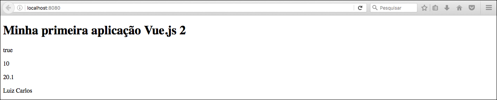

# Property binding

Antes de falarmos sobre **property binding** daremos outros exemplos de **data binging** para fixarmos melhor. Nós precisamos informar que o nosso objeto **data**, que definimos em nosso arquivo **main.js**, pode trabalhar com muitos modelos de dados. Além de uma string pode ser um número inteiro, um número decimal, booleano e também objetos.

Lembre-se que você é responsável por controlar todos os dados da sua aplicação. E não tem outra forma de controle, dentro da instância Vue, a não ser utilizando objetos. Portanto qualquer valor que for controlar deverá adicionar um objeto referente a ele.

**Exemplos**
```json
new Vue({
  el: '#app',
  data: {
    título: "Minha primeira aplicação Vue.js 2",
      bool: true,
      numeroInteiro: 10,
      numeroFloat: 20.10,
      objeto: {
        name: "Luiz Carlos"
      }
  }
})
```

***

```html
<div id="app">
    <h1>{{ título }}</h1>
    <p>{{ bool }}</p>
    <p>{{ numeroInteiro }}</p>
    <p>{{ numeroFloat }}</p>
    <p>{{ objeto.name }}</p>
</div>
```

Resultado:



Vamos explicar a diferença entre a estrutura utilizada na versão 1 e o **property binding**, utilizada pelo Vue 2. Pela diferença, dos dois modelos, da para entender melhor.

***

## Modelo antigo do uso de propriedades

```html
    <div id="app">
      <h1 id="{{ numeroInteiro }}">{{ título }}</h1>
    </div>
```


Na versão 1 poderíamos utilizar o código acima que não teríamos problema algum e a interpolação iria definir o **id** com o valor informado, porém com o Vue 2 este modelo foi depreciado. Se rodar em seu browser irá ocorrer um erro, onde pode conferir no console do seu developer tool.


