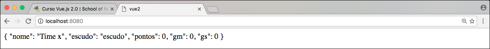

# Criando classe Time

Nosso intuito é lhe ensinar, além do Vue 2, a montar uma aplicação prática. Então, como exemplo prático, iremos montar a **Tabela do Brasileirão Série A**. Para os amantes do futebol e da programação.

Para este início já temos, na pasta **assets**, todos os escudos, dos times que estão na série A no ano de 2016. Data em que criamos este conteúdo.

Iremos ter uma tabela completa, com jogos, pontos, saldo de gols e todos os dados necessários para a criação desta tabela. Um ótimo exemplo para entendermos o funcionamento do Vue.js.

Como estamos trabalhando com a ES6, iremos criar uma classe para abrigar os dados de cada time. Então o primeiro passo será criar um arquivo chamado **time.js** no mesmo nível do arquivo **main.js**, por enquanto. Este arquivo conterá uma classe chamada **time**.

### Conteúdo do nosso arquivo time.js
```
export class Time{
    constructor(nome, escudo){
        this.nome = nome;
        this.escudo = escudo;

        this.pontos = 0;
        this.gm = 0;
        this.gs = 0;
    }
}
```

Podemos verificar que utilizamos o **export** da nossa ES6 e criamos uma classe simples que recebe dois parâmetros em seu construtor: **nome** e **escudo**

Atribuímos também valores iniciais para **pontos**, **gols marcados = gm** e **gols sofridos = gs**.

***

### Conteúdo do nosso main.js

```
import Vue from 'vue'
import {Time} from './time';

new Vue({
  el: '#app',
  data: {
    time: new Time('Time x' , 'escudo')
  }
})
```
Importamos a nossa classe, que anteriormente foi exportada, e logo em seguida criamos um objeto chamado **time**, como um modelo de dados, e instanciamos nossa classe **Time** passando os dois parâmetros do construtor.

Em nosso exemplo colocamos **Time x** e **escudo**. Time x apenas para evitar conflitos entre os torcedores que estarão lendo este conteúdo. Desta forma estamos sendo o mais imparcial possível.

***

### Resultado no browser



***

Como criamos uma classe genérica podemos utilizá-la para todos os times da Série A. Desta forma estamos reaproveitando código e otimizando nosso processo.

Estamos também separando as regras da nossa aplicação. Gerenciar estas regras será papel de nossa classe e não do arquivo **main.js**. É muito importante esta separação de responsabilidades. Tanto para manutenção futura quanto para organização e boas práticas de programação.

O próximo passo será adicionarmos algumas funcionalidades do **webpack** para que as imagens apareçam na nossa **view**. Porque não trabalharemos com caminho absoluto dos arquivos para exibição. Desta forma, se faz necessário, a adição de alguns elementos para que o **webpack** inclua este processo ao empacotamento do javascript.