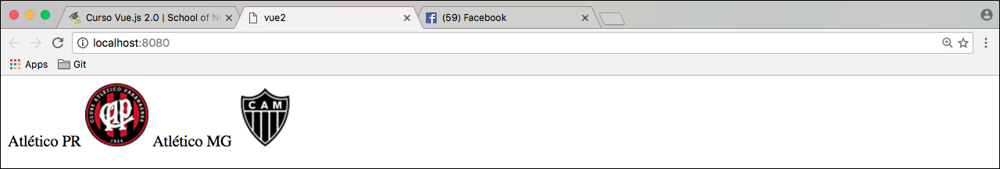
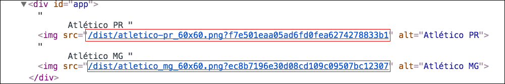

# Mostrando escudo dos times

Iremos trabalhar com o conteúdo mais consistente dos times, que será o escudo de cada um deles.

Para conseguirmos exibir estas imagens, teremos que utilizar a tag **img** do HTML. Conforme código abaixo:

`{{ time }} `

Precisaremos de uma **url**, para a exibição destas imagens. 
O webpack faz a geração da url pra nós, ao empacotar os arquivos. 

Vamos entender como isso é feito.

Existe um **loader** do webpack, que nos ajuda a fazer um **require** em um arquivo de imagens e, a partir daí, conseguimos resgatar o endereço do arquivo empacotado,  para exibição.

Abaixo, iremos mostrar qual é a configuração que faz isso pra nós:


A imagem, acima, foi retirada do arquivo **webpack.config.js** que é gerado pelo **vue-cli**, na criação do nosso template. Trata-se de um **módulo**, que é rodado dentro do webpack, para o empacotamento de arquivos. 
Nesta imagem observamos que podemos passar os tipos de arquivos que queremos que o webpack empacote. 
Caso não seja nenhum dos tipos citados, o webpack pula o empacotamento. Caso o tipo do arquivo esteja especificado, o webpack empacota tudo pra nós.

A **url** gerada pelo empacotamento, segue a regra da configuração presente na imagem: **[nome].[ext]?[hash]**.

Por este motivo, seria muito complicado, se precisássemos colocar, manualmente, os caminhos absolutos de cada arquivo. Pensando nisso, o webpack nos possibilita utilizar somente um **require**, informando apenas, o caminho do arquivo e o restante, ele faz pra nós.

**Exemplo**

Para a exibição de um time e seu escudo faremos desta forma:

# Nosso arquivo main.js

```
data: {
time: new Time('América MG' , require('./assets/america_mg_60x60.png'))
}
```
# Nosso arquivo index.html

`{{ time.nome }} `

***

Desta forma podemos ir replicando para a exibição de quantos times quisermos.

```
data: {
time1: new Time('América MG' , require('./assets/america_mg_60x60.png')),
time2: new Time('Atlético MG' , require('./assets/america_mg_60x60.png'))
}
```

```html
{{ time1.nome }} 
{{ time2.nome }} 
```

***

Resultado:



# Mas onde está a vantagem do file-loader

Se analisarmos o código renderizado, saberemos a vantagem e a facilidade que o **file-loader** nos proporciona. Veja imagem abaixo:



A **url** gerada pelo empacotamento do webpack tem a vantagem de não gerar cashe, pelo fato de utilizar um hash. 
O **file-loader** se torna completo, por fazer o empacotamento e trazer uma solução simples para o resgate da url dos arquivos empacotados.

Basta utilizarmos o **require**, `require('./assets/america_mg_60x60.png')`, em vez de termos que colocar as **urls**,  abaixo, em cada arquivo:

`/dist/atletico-pr_60x60.png?f7e501eaa05ad6fd0fea6274278833b1`
`/dist/atletico_mg_60x60.png?ec8b7196e30d08cd109c09507bc12307`

Ao empacotar, o webpack envia os arquivos para a pasta **dist**, conforme observado, acima.

***

# Considerações finais

Apesar de estar muito fácil a exibição de um time, não faz sentido ficar replicando este código para cada time que será exibido. Não seria nada produtivo.

Por este motivo, iremos ensinar como fazer isso de uma forma otimizada. 
Assim, poderá imprimir vários times de uma vez, com um código muito pequeno.

Continue acompanhando o conteúdo e verá o poder que o Vue.js tem.