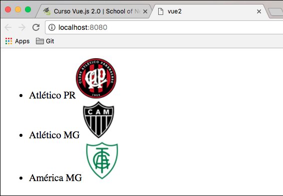
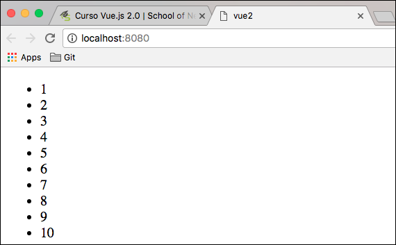
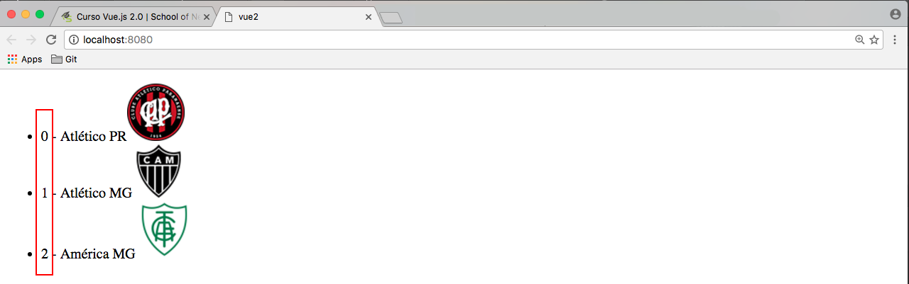
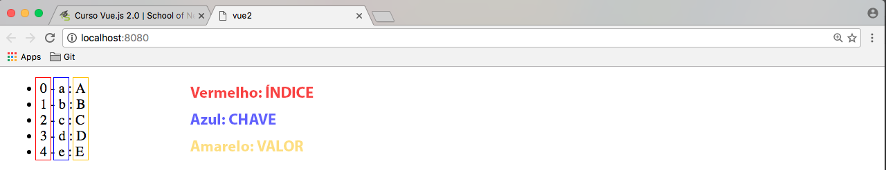

# Lidando com coleções - v-for

Para mostrarmos uma **coleção de dados**, de uma só vez, podemos utilizar os recursos que o Vue.js nos proporciona.

Existe uma diretiva do Vue, que manipula o HTML. Na verdade, ela replica o código HTML, quantas vezes forem necessárias, a partir do número de itens que existem na coleção. 
Quando falamos de coleção, estamos falando de um **array**, ou seja, quando temos dados agrupados.

Para darmos início ao nosso exemplo, precisaremos criar, dentro do **data**, um array com todos os times que quisermos listar. Veja abaixo:

```
data: {
    times: [
        new Time('Atlético PR' , require('./assets/atletico-pr_60x60.png')),
        new Time('Atlético MG' , require('./assets/atletico_mg_60x60.png')),
        new Time('América MG' , require('./assets/america_mg_60x60.png'))
    ]
}
```

E nosso HTML fica muito mais simples, utilizando o famoso **v-for**:

```html
<ul>
    <li v-for="time in times">
        {{ time.nome }}
    </li>
</ul>
```

Basta escolhermos qual será o elemento que irá repetir. Neste caso, decidimos utilizar a estrutura de **lista**. Portanto, nosso item repetidor é o **<li>**.

O **v-for** é uma estrutura de repetição, onde o Vue reconhece que **times** é um array que foi declarado na instância Vue. Dessa forma, ele se encarrega de gerar o html, quantas vezes forem necessárias, a partir da quantidades de itens adicionados ao **array times**.

Caso informe algum valor que não exista ou não esteja declarado, o próprio Vue nos reportará um erro. 
Trocaremos o nome do nosso array **times** para **times1**. 
Veja o erro reportado:


Por este motivo, não precisamos nos preocupar, porque o Vue nos informará qualquer erro, durante a renderização da nossa aplicação.

É extremamente aconselhável, desenvolver sempre com o seu **developer tools** aberto, para que possa ir acompanhando a sua aplicação e os eventuais erros que possam ocorrer.

# v-for com números

Não precisamos, necessariamente, ter um array de objetos, para listar usando **v-for**. Poderia ser um array de números ou até mesmo, não existir array.

Veja o exemplo abaixo, sem a existência de um array:

```html
<ul>
    <li v-for="x in 10">{{ x }}</li>
</ul>
```

Assim, teremos a listagem de 1 até 10, de uma forma muito simples e rápida.

# Visualizando exemplos de v-for

v-for (__times__) | v-for (__Números__)
------------------------ | -----------------------------
 | 

***

Podemos, também, utilizar outros parâmetros no **v-for** como o **índice** de cada elemento do array. 

Por exemplo:

```
<ul>
    <li v-for="(time,index) in times">
        {{ index }} - {{ time.nome }}
    </li>
</ul>
```

Reparem que, no lugar do primeiro elemento do v-for - **time**, como era no primeiro exemplo, mudamos para **(time,index)**. Isso significa que o primeiro elemento continua sendo cada item do array e o index passa a ser o índice de cada elemento. Veja na imagem, abaixo, o resultado do código:



# Interação com objetos, sem presença de array

Primeiro vamos criar um objeto em nosso modelo de dados: **data**:

```
data: {
    alfabeto: {
      a: A,
      b: B,
      c: C,
      d: D,
      e: E
    }
}
```

Depois vamos fazer nosso v-for no index.html:

```html
<ul>
    <li v-for="(valor,chave,index) in alfabeto">
        {{ index }} - {{ chave }} : {{ valor }}
    </li>
</ul>
```

Veja que agora temos 3 valores no primeiro item do nosso v-for.

1. valor = **A**
2. chave = **a**
3. index = **índices** de cada elemento do objeto

E o segundo elemento do nosso v-for, como sempre, é nosso objeto ou array a ser percorrido: **alfabeto**

Veja o resultado deste último caso de v-for:

