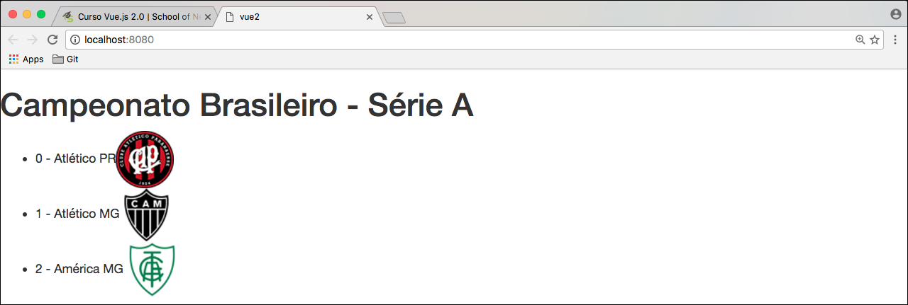

# Integração com Bootstrap

Agora que já sabem fazer repetições utilizando o **v-for** e também listagem de coleções, iremos listar todos os times da **Série A** do campeonato Brasileiro de futebol.

Porém queremos estilizar um pouco, para que não fique somente listagem. Portanto aproveitaremos para ensinar vocês a integração com o **Bootstrap**, desta forma poderão utilizar em todos os seus projetos futuros, caso gostem deste **Framework CSS**.

Para iniciarmos o processo vamos precisar utilizar o terminal e a ferramenta gerenciadora de pacotes do **Node**. Nosso famoso **npm**.

# Instalando Bootstrap

Em seu terminal, na pasta raiz da aplicação, rode os comandos abaixo:

1. `$ npm install bootstrap --save`
2. `$ npm install jquery --save`

Com estes dois comandos já teremos a instalação e a gravação das bibliotecas como dependência, em nosso package.json.

Você deve estar se perguntando a respeito do **jQuery** e vamos explicar. O **Bootstrap** utiliza o **jQuery** a todo momento, portanto a instalação do mesmo é extremamente necessário para que o Bootstrap funcione corretamente. Existe uma **dependência** do **jQuery**, por este motivo que iremos instalar.

Por enquanto verá que não teremos problema algum. Poderia estar tudo bem se não fossem as fontes.

Como nos arquivos iniciais do **Bootstrap** existe o carregamento das fontes e dos ícones por **url** o nosso Vue.js não irá conseguir fazer este carregamento pelo mesmo problema dos arquivos.

> ### Lembram que utilizamos o **file-loader** para conseguir resgatar a url dos arquivos?

Para resolver esta incompatibilidade, existe um outro **loader**, chamado **url-loader**, e iremos instalar como dependência de desenvolvimento, para conseguir utilizar o nosso Bootstrap corretamente. Desta forma não teremos problemas para carregar as **fonts**.

`$ npm install url-loader --save-dev`

Instalaremos também um outro **loader** que será responsável por gerar nosso arquivo de **css** no início da nossa aplicação sem que precisemos utilizar a tag **link** em nosso HTML.

`$ npm install style-loader --save-dev`

Basta que façamos um require no css e ele já irá inserir o nosso css em nossa aplicação. Mais tarde iremos mostrar como isso funciona.

# Configuração

Depois de tudo devidamente instalado, iremos precisar fazer algumas configurações, para que tudo funcione corretamente. Voltaremos ao nosso webpack.config.js.

Dentro do arquivo webpack.config.js existe um objeto chamado module e dentro dele um array chamado rules, que são as regras. Será dentro deste array que iremos incluir a nossa regra do url-loader.

```
{
    test: /\.(woff|woff2|ttf|svg|eot)$/,
    loader: 'url',
}
```

*Explicando melhor a regra:*

1. test - O test se trata de uma expressão regular que será responsável por identificar arquivos, durante o empacotamento. Quando o webpack encontra arquivos que fazem parte do "test", ele executa a lógica do loader.
2. loader - se refere a qual loader iremos aplicar quando test for válido. O valor 'url' significa que vamos utilizar o 'url-loader'. Este loader irá gerar caminhos próprios dentro de arquivos CSS para que o empacotamento do Bootstrap CSS não fique sem seus devidos arquivos de fonte.

***

Depois de incluir a configuração do url-loader iremos fazer o require do nosso css, em nosso arquivo main.js. Veja abaixo como utilizar css-loader e **style-loader**:

```
require('bootstrap/dist/css/bootstrap.min.css');
```

A função require, em teoria, deveria carregar corretamente o CSS do Boostrap, porém o conteúdo do arquivo não é carregado no HTML. Assim, temos que usar dois loaders para realizar este trabalho:

```js
require(style-loader!css-loader!'bootstrap/dist/css/bootstrap.min.css');

// ou a forma abreviada dos loaders, que seria só o primeiro nome do loader

require(style!css!'bootstrap/dist/css/bootstrap.min.css');
```

Os loaders são aplicados da direita para a esquerda. Desta forma primeiro aplicamos o css-loader que saberá a forma correta de chamar nosso css. Depois o style-loader será capaz de incluir o nosso css em nosso arquivo index.html para que o css possa ter efeito em nossa aplicação.

***

Você ainda terá um erro referente ao jQuery, porque nós precisamos carregar ele no início de nossa aplicação, senão ele vai não será reconhecido. Segue imagem:


Para resolver este problema precisaremos rodar um plugin em nosso arquivo webpack.config.js.

```
plugins: [
    new webpack.ProvidePlugin({
        'jQuery': 'jquery'
    })
],
```
Colocamos este objeto, chamado **plugins** entre os objetos *module* e *resolve*.

Depois destas configurações vamos precisar rodar o nosso servidor novamente: `$ npm run dev`.

E agora sim podemos ver nossa aplicação com tudo funcionando corretamente. Veja nosso arquivo de css carregado corretamente na imagem abaixo:


***

Estamos caminhando para uma nova fase, do desenvolvimento, onde o Javascript estará no controle da situação. Neste caso temos o javascript carregando e inserindo o css em nossa aplicação. Daqui pra frente será cada vez mais comum nos depararmos com estas casos.

***

# Teste de bootstrap

Já vimos que o código do bootstrap está sendo inserido em nosso documento, mas para concluirmos que ele está realmente integrado a nossa aplicação, vamos inserir uma tag *h1* para termos esta certeza.



***

Pronto pessoal, agora sim podemos dizer que nosso Bootstrap está instalado, integrado e funcionando em nossa aplicação.

Uma vez que trabalhamos com o webpack temos o controle geral de todo nosso projeto. Podemos inserir sass, less, bootstrap, vue.js e tudo que quisermos. Temos o controle desse ecosistema e o webpack faz tudo pra gente.