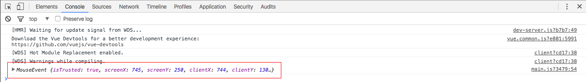

# Eventos - rodando placar

Precisamos entender que quando o usuário estiver manipulando a aplicação web ele vai realizar tarefas que vão desparar eventos no javascripts e nos elementos html.

Existem vários eventos possíveis:

1. Clique botão direito
2. Clique botão esquerdo
3. Duplo clique
4. Digitar algo no teclado
5. Rolar a barra

O Vue nos ajuda a controlar todos estes eventos de formas mais simples.

***

# v-on

O v-on é uma diretiva que precede o evento que queremos executar. Vamos começar por mostrar o evento **click** utilizando o v-on.

Mantendo nossa propriedade **teste** que foi definida como exemplo no conteúdo passado, vamos apenas alterá-lo para 0.

Depois iremos atribuir o evento ao nosso elemento **button** do html para simular um contador. Iremos remover os inputs somente neste exemplo para não ficar extenso, no seu caso não precisa alterar:

```html
<form class="form-inline">
    <button type="button" class="btn btn-primary" v-on:click="teste++">Fim de jogo</button>
    {{ teste }}
</form>
```

Cada vez que clicarmos no botão acima o Vue irá disparar um evento de click, que por sua vez está acessanto nosso modelo de dados e somando 1 à propriedade **teste** a cada clique. Este é nosso primeiro exemplo de evento click com v-on.

Veja que colocamos uma interpolação abaixo do elemento button para que possa visualização o evento sendo executado, não se esqueça de eliminar este teste, pois não faz parte do projeto.

Juntamente com o v-on existem vários outros eventos, além do click. Podemos utilizar o evento keyup, keypress, mouseHover e muitos outros. Existe uma listagem de eventos que você poderá utilizar. Mas além de todos estes eventos temos também a possibilidade de chamar métodos criados em nossa instância Vue.

Para começarmos a trabalhar com métodos, devemos saber como declarar nossos métodos no Vue.js.

***

# Declarando métodos no Vue.js

Existe uma propriedade, que devemos adicionar em nossa instância do Vue, que se chama **methods** e é padrão do Vue. Veja um exemplo abaixo:

```
let meuVue = new Vue({
    el: '#app',
    data: {

    },
    created(){

    },
    methods:{

    }
});
```

***

Dentro da propriedade acima iremos colocar todos os nossos métodos. Isso não significa que eles só serão executados por eventos. Podemos utilizar em toda aplicação Vue.js.

## Definindo primeiro método

```
methods: {
    clicouMe(){
        alert('Me clicou!!!')
    }
}
```

Chamando nosso método em nossa view, utlizando a diretiva v-on com evento click.

```html
<form class="form-inline">
    <button type="button" class="btn btn-primary" v-on:click="clicouMe">Fim de jogo</button>
</form>
```


Desta maneira acabamos de criar uma ligação do elemento HTML com os métodos da aplicação. Você poderá usar da maneira que achar necessário em seu projeto.

Podemos passar parâmetros para os métodos criados e quantos parâmetros forem necessários. Podemos até pegar os dados do eventos se for necessário.

Vejamos um exemplo prático:

```
methods: {
    clicouMe(event){
        console.log(event);
    }
}
```

Chamando nosso método em nossa view, utlizando a diretiva v-on com evento click.

```html
<form class="form-inline">
    <button type="button" class="btn btn-primary" v-on:click="clicouMe($event)">Fim de jogo</button>
</form>
```

Lembrando que não é necessário colocar os parênteses na chamada do método, caso não haja nenhum parâmetro. Neste caso como estamos passando a variável **reservada** `$event` estamos utilizando.



Pelo evento mostrado em nosso console podemos acessar muitas informações referentes ao evento. Temos acesso a qual elemento html foi o emissão do evento até mesmo a posição do mouse. O Vue é realmente uma ferramente muito simple e muito poderosa ao mesmo tempo.

***

## Passando mais do que um parâmetro para o método

```
methods: {
    clicouMe(event,param1, param2){
        console.log(param1);
        console.log(param2);
    }
}
```

```html
<form class="form-inline">
    <button type="button" class="btn btn-primary" v-on:click="clicouMe($event,1,2)">Fim de jogo</button>
</form>
```


***

# v-on forma abreviada

Podemos utilizar tando a diretiva v-on quando o @. Ambos terão o mesmo efeito, porém o segundo é mais visual. E batante os olhos já sabemos que no código está acontecendo um evento do Vue.js ou um evento javascript consequentemente.

**Exemplo:** `v-on:click="clicouMe($event,1,2)"` ou `@click="clicouMe($event,1,2)"`

***

# Definindo método manipular dados dos times na classe Time

Iremos agora criar um método onde poderemos definir e calcular quantos pontos que o time irá ganhar. Definir se o time ganhou ou perdeu e tudo que for relacionado a dados da partida e do time.

```
    updateInfo(pontos, golsMarcados, golsSofridos){
        this.pontos += pontos;
        this.gm += golsMarcados;
        this.gs += golsSofridos;
    }

    fimJogo(timeAdversario, gols, golsAdversario){
        if( gols == golsAdversario){
            this.updateInfo(1,gols, golsAdversario);
            timeAdversario.updateInfo(1, golsAdversario, gols);
        }else{
            if(gols > golsAdversario){
                this.updateInfo(3,gols, golsAdversario);
                timeAdversario.updateInfo(0, golsAdversario, gols);
            }else{
                this.updateInfo(0,gols, golsAdversario);
                timeAdversario.updateInfo(3, golsAdversario, gols);
            }
        }
    }
```

Em nossa classe **time** adicionamos os métodos acima e iremos explicar agora.

## Método fimJogo

O método recebe 3 parâmetros:  Time adversário, gols marcados pelo time da casa e gols marcados pelo adversário.

Neste método fazemos 3 lógicas:

1. Primeiro testamos se o número de gols dos dois times são iguais, se for sabemos que houve empate na partida.
2. Se não houve empate algum time ganhou.
    * Testamos então se o número de gols do time da casa é maior que os gols do time adversário. Caso seja concluímos vitório do time da casa.
    * Caso contrário a vitória foi do time adversário ou visitante.

Esta foi a lógica que utilizamos para ver qual time foi o vencedor, você pode utilizar outro caso queira praticar.

## Método updateInfo

O método recebe 3 parâmetros: pontos, golsMarcados e golsSofridos.

Utilizaremos este método para fazer as alterações em nossa propriedade times. Cada vitória somará 3 pontos para o time vencedor ou somará 1 ponto para cada time em caso de empate. Teremos que atualizar também, simultaneamente, o número de gols marcados e sofridos por cada time.

Este método será responsável por atualizar os dados de cada time cada vez que solicitado. Utilizamos o **this** para atualizações ao time da casa e timeAdversário para atualizações ao adversário.

***

# Definindo método manipular dados dos times na instância Vue

Apagaremos o método anteriormente criado para teste, chamado **clicouMe** e adicionaremos nosso método real:

```
methods:{
    fimJogo(){
        let timeAdversario = this.novoJogo.fora.time;
        let gols = +this.novoJogo.casa.gols;
        let golsAdversario = +this.novoJogo.fora.gols;
        this.novoJogo.casa.time.fimJogo(timeAdversario, gols, golsAdversario);
    }
}
```

Este método será executado quando houver o evento de clique no botão **Fim de Jogo** em nossa view.

Criamos as variáveis que serão necessárias para alimentar nosso método de nossa classe Time. Informamos que o sinel de adição **(+)** antes dos valores, no método acima, serve para forçar que o valor seja inteiro, pois os capos trarão os dados como texto.

Depois que populamos todas as variáveis, nós finalmente chamamos nosso método de nossa classe Time para fazer toda a nossa lógica. Depois de tudo isso temos que chamar nosso método em nossa view.

```html
<form class="form-inline">
    <button type="button" class="btn btn-primary" @click="fimJogo">Fim de jogo</button>
</form>
```

Faça o teste em seu projeto para ver se realmente não comoteu nenhum erro, durante o desenvolvimentoantes, antes de continuar com o conteúdo. Com este procedimento acabamos de criar a dinâmica de nossos jogos.


