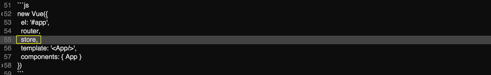

# Configurando Vue Routes, Vuex, e Vue Resource

Já falamos sobre configurações de **build** e **dev**. Partiremos para as instalações que serão necessárias.

Instalaremos, utilizando o npm, rodando o comando abaixo:

`npm install --save vue-resource vuex vuex-router-sync`

Após esta instalação, faremos a chamada destes arquivos, em nosso arquivo **main.js**, que está presente na pasta **src**.

Todas as configurações, geralmente, são feitas neste arquivo porque ele é nosso arquivo de entrada.

```js
// The Vue build version to load with the `import` command
// (runtime-only or standalone) has been set in webpack.base.conf with an alias.
import { sync } from 'vuex-router-sync'

import Vue from 'vue'
import Vuex from 'vuex'
import VueResouce from 'vue-resource'
import VueRouter from 'vue-router'

Vue.use(Vuex)
Vue.use(VueResouce)
Vue.use(VueRouter)

import App from './App'
import routes from './router'
import VuexStore from './vuex/store'

Vue.http.options.root = process.env.SERVER

const store = new Vuex.Store(VuexStore)
const router = new VueRouter({
  routes
})

sync(store, router)

/* eslint-disable no-new */
new Vue({
  el: '#app',
  router,
  store,
  template: '<App/>',
  components: { App }
})
```
Após realizarem todas as importações e configurações, utilizando o **use**, para informar que o **Vue** deverá se integrar com as outras funcionalidades, configuramos a rota do servidor, utilizando o vue-resource. Vejam o código abaixo:

`Vue.http.options.root = process.env.SERVER`

Fazendo isso, sempre que tivermos uma requisição, sem barra no começo da url, ou sem **http**, o vue-resource entenderá que não estamos acessando o servidor que foi configurado.

Notem que, primeiro nós importamos o **vuex-router-sync**, para conseguirmos evitar alguns conflitos entre vuex e vue-router. Em seguida, fizemos uma configuração, antes de instanciar o **Vue**.

```js
const store = new Vuex.Store(VuexStore)
const router = new VueRouter({
  routes
})

sync(store, router)
```

Não esqueçam de passar a propriedade **store** para a intância do Vue.



Após terem adicionado as configurações, modificaremos o arquivo index.js, que está dentro da pasta **src/router**, para o conteúdo abaixo:

```js
import Hello from 'components/Hello'

const routes = [
  {
    path: '/',
    name: 'Hello',
    component: Hello
  }
]

export default routes
```

Após concluírmos todas as alterações, podemos rodar o comando `npm run dev`, que nossa aplicação estará rodando, sem nenhum erro.

Desse modo, configuramos o **vuex**, o **routes** e o **resources** e, consequentemente, temos a aplicação funcionando.

Agora que temos todas as configurações prontas e centralizadas no arquivo main.js, podemos dar início ao nosso desenvolvimento. Lembrando que, caso tenham alguma informação que pode ser alterada, de acordo com o ambiente, vocês podem utilizar os arquivos de configuração para configurar valores e chamar, dinamicamente, no arquivo main, assim como foi feito com o SERVER.