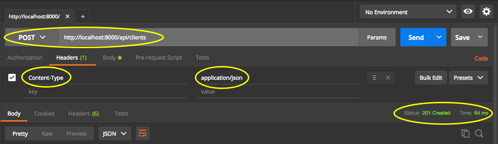
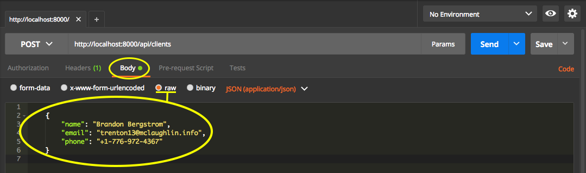

# REST - POST clients

Criaremos um novo recurso, trabalhando com o verbo http POST. Configuraremos um novo endpoint para acessar este novo recurso, para a criação de novos clientes.

```php
$app->group([
    'prefix' => '/api/clients',
    'namespace' => 'App\Http\Controllers'
], function() use($app) {
    $app->get('','ClientsController@index');
    $app->get('{id}','ClientsController@show');
    $app->post('','ClientsController@store');
});
```

Criamos uma endpoint, sem parâmetros, apontando para o mesmo controller e executando uma action chamada **store**. Geralmente, quando trabalhamos com Laravel ou Lumen, utilizamos store, para criação de dados. Vocês podem utilizar o nome que quiserem.

Vejam o método do controller:

```php
public function store(Request $request)
{
    $client = Client::create($request->all());
    return response()->json($client,201);
}
```

Desta vez, estamos passando a Request para o método, para que tenhamos acesso aos dados que estão sendo enviados para cadastro. Depois, utilizamos o método create, passando todos os dados da requisição.

Notem que, não faria sentido não informar ao usuário de que a requisição foi bem sucedida, ou  informar, apenas, o status 200, que significa sucesso na requisição. Sugerimos que acessem o site da W3C para saberem mais sobre status code, para que  API RESTful seja a mais completa possível. Com certeza, existirá um status code para o que vocês precisam retornar ao usuário, de forma mais específica, do que apenas um status 200.

Acessem: <https://www.w3.org/Protocols/rfc2616/rfc2616-sec10.html> ou pesquisem por **status code W3C**, no google.

Observem que existe o status code **201**, que se refere a um elemento criado com sucesso. Este, foi o status code que utilizamos. Além do status code, estamos retornando o cliente criado, como resposta.

Agora, basta  irem até o Postman, alterarem o método de requisição para **POST**, informar o header que estamos passando um conteúdo json, montar os dados em um formato JSON, utilizando o modo raw e depois enviar. Obterão, como resposta, o status code que passamos em nosso método do controller.

Vejam as imagens para entenderem melhor o procedimento:





Vocês podem acrescentar os dados que quiserem. Pegamos dados já existentes nos cadastros. Depois de ter submetido e obtido sucesso no cadastro, vocês podem alterar o métodos para get e listar os itens, novamente, para confirmarem o sucesso do cadastramento dos novos itens.

Lembrem-se que esta requisição altera o estado da aplicação e é considerada não segura, de acordo com nossos conceitos de REST. Isso não deve ser motivo de preocupação, porque trataremos as autenticações, antes de permitir que qualquer usuário faça estas requisições. Foquem, apenas, no conceito de segura e não segura, referente à arquitetura REST.

O importante de retornarmos o status code é que, a aplicação pode verificar o sucesso da criação do cliente. Em uma aplicação de pagamentos, via cartão de crédito, por exemplo, podemos retornar um status de processando, enquanto o pagamento é efetuado, para somente depois, finalizar o pagamento. Trabalhar com a arquitetura REST exige que trabalhem de uma forma mais séria e organizada.

Encare a sua API RESTful como uma aplicação profissional e terão um webservice completo.