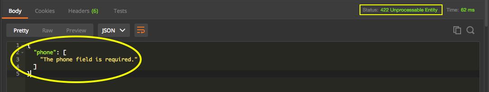

# Tratamento de erro 422 - Validação

Vamos supor que trabalharemos com validação de dados.

A arquitetura REST prevê o que temos que fazer mas, não tem um modo definido de como deve ser feito. Toda tratativa de erros, devemos implementar, diretamente, nos métodos que criarmos.

O Lumen já possui um método para nos ajudar. O método é chamado de **Validate** e nos ajuda a receber a mensagem na resposta e com os erros já formatados, além do status code correto.

Lembrando que, quando o usuário envia um dado inválido, o erro é do lado do cliente e não mais no servidor. O cliente, teoricamente, não deveria enviar este dado errado. Por isso, devemos escolher um erro da família dos **400**, como status code.

Começarems a aplicar a tratativa no método store, que é nosso método de criação.

```php
public function store(Request $request)
{
    $this->validate($request, [
        'name' => 'required',
        'email' => 'required',
        'phone' => 'required',
    ]);

    $client = Client::create($request->all());
    return response()->json($client,201);
}
```

Desta forma, estamos tornando todos os campos, obrigatórios. Anteriormente, se o usuário enviasse algum campo vazio, a API aceitaria e cadastraria o usuário.

```json
{
    "name": "Luiz Carlos",
    "email": "luiz@schoolofnet.com",
    "phone": ""
}
```

Suponham que, o usuário  manda uma requisição com os dados acima. Como o telefone é um campo obrigatório, não será permitido um valor nulo e a API retornará o seguinte erro:

```json
{
  "phone": [
    "The phone field is required."
  ]
}
```



Façam o teste no Postman, enviando um cadastro com algum campo em branco. Vocês poderão conferir o erro acima.

Observem que o Lumen gera o status code 422, que informa o não processamento da requisição, por falta de dados para o recurso.

Faremos a mesma validação para o método update. Adicionaremos depois da primeira validação, que testa se o id passado existe, realmente.

```php
public function update($id , Request $request)
{
    if(!($client = Client::find($id))):
        throw new ModelNotFoundException("Client requisitado não existe");
    endif;

    $this->validate($request, [
        'name' => 'required',
        'email' => 'required',
        'phone' => 'required',
    ]);

    $client->fill($request->all());
    $client->save();
    return response()->json($client,200);
}
```

Estamos com os dois métodos validados.

Existem algumas APIs que retornam um status code 200, mas com uma mensagem de erro. Isso funciona, mas temos um erro de semântica, neste procedimento. Como uma API retorna um erro com status 200, sendo que 200 é um sucesso?

Precisamos ficar atentos a estes pequenos detalhes, porque se tem um sucesso, não pode haver um erro e o contrário também se aplica.